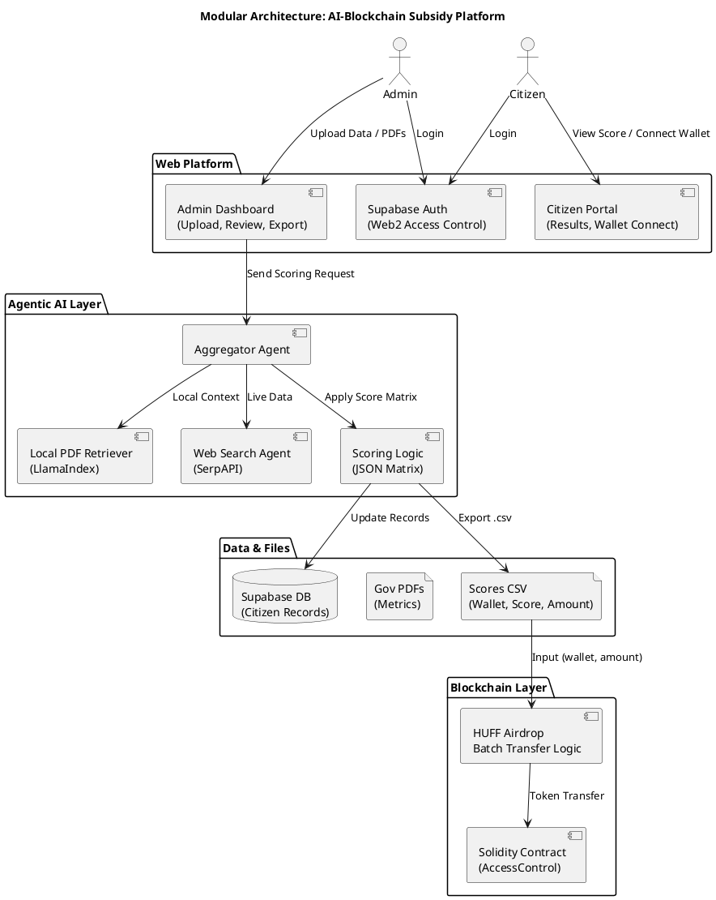

# 📚 Knowledge Base: AI-Blockchain Subsidy Distribution Platform

This document is a complete knowledge base for the Claude Code team working on the AI-powered blockchain-based subsidy distribution system. It contains architecture, tech stack, deployment guides, terminal commands, and project structure.

---

## 📦 Project Overview

An agentic RAG-powered platform to automate subsidy distribution using open-source AI models, Supabase, and smart contracts (Solidity + HUFF). Citizens are scored via AI agents, and subsidies are airdropped through optimized smart contracts.

---

## 🧩 Modular Architecture (Clean & Understandable)

| Module                 | Description                                                       |
| ---------------------- | ----------------------------------------------------------------- |
| Authentication & Roles | Web2 login (Supabase), on-chain AccessControl for Admin/Citizen   |
| Admin Dashboard        | Upload citizen data & PDFs, view scores, export CSV               |
| Agentic RAG Engine     | Multi-agent AI (local PDFs + web search) → score computation      |
| Scoring System         | Scoring matrix logic, DB updates, `.csv` generation               |
| Blockchain Layer       | Smart contracts (Solidity + HUFF) for access control and airdrops |
| Citizen Portal         | View eligibility, connect wallet, receive tokens                  |

---

## ✅ Architecture Diagram (PlantUML)



---

## 🛠️ Tech Stack

| Layer        | Tools                                     |
| ------------ | ----------------------------------------- |
| AI Engine    | LangChain, LangGraph, LlamaIndex, LLaMA 3 |
| Backend      | FastAPI / Node.js                         |
| Vector DB    | ChromaDB / pgvector                       |
| Frontend     | React or Next.js, Supabase UI             |
| Auth & DB    | Supabase (Postgres + Auth)                |
| Blockchain   | Solidity + HUFF + Foundry                 |
| **ZK Proofs**| **Circom 2.1.5, snarkjs, Groth16**        |
| Search Agent | SerpAPI or Tavily                         |

---

## 🔐 **COMPLETE GROTH16 ZK-SNARK IMPLEMENTATION**

### **ZK Proof Pipeline (Production-Ready)**
Reference script for complete Groth16 implementation:

```bash
#!/bin/bash
# Complete ZK proof generation and verification pipeline
set -e

# Create output directories
mkdir -p outputs proofs inputs

# 1. Compile circuit
circom circuits/MalaysianIncomeClassifier.circom --r1cs --wasm --sym -o outputs/ -l node_modules

# 2. Download Powers of Tau (Universal Trusted Setup)
if [ ! -f "outputs/pot12.ptau" ]; then
    echo "Downloading Powers of Tau file (2^12 constraints)..."
    wget https://storage.googleapis.com/zkevm/ptau/powersOfTau28_hez_final_12.ptau -O outputs/pot12.ptau
fi

# 3. Generate proving/verification keys (Circuit-Specific Setup)
snarkjs groth16 setup outputs/MalaysianIncomeClassifier.r1cs outputs/pot12.ptau outputs/circuit.zkey

# 4. Export verification key
snarkjs zkey export verificationkey outputs/circuit.zkey outputs/verification_key.json

# 5. Generate witness from inputs
node outputs/MalaysianIncomeClassifier_js/generate_witness.js outputs/MalaysianIncomeClassifier_js/MalaysianIncomeClassifier.wasm inputs/input.json outputs/witness.wtns

# 6. Generate ZK proof (THE CORE ZK STEP)
snarkjs groth16 prove outputs/circuit.zkey outputs/witness.wtns proofs/proof.json proofs/public.json

# 7. Verify proof (Independent verification without revealing private inputs)
snarkjs groth16 verify outputs/verification_key.json proofs/public.json proofs/proof.json

echo "✅ Complete ZK proof pipeline successful! Check proofs/public.json for verification!"
```

### **ZK System Architecture**
```
Citizen IC → LHDN API → Private Income → ZK Circuit → Public Proof
                     (RM 2000 - HIDDEN)              (B1 bracket - PUBLIC)
                           ↓
                    ZK Proof Generation
                    {π_a, π_b, π_c, public_signals}
                           ↓
                    Independent Verification
                    (Verifier never sees actual income!)
```

### **Frontend Integration Pattern**
```typescript
// IC-triggered auto-verification flow
const handleICVerification = async (ic: string) => {
  setVerificationStatus('loading');
  
  // 1. Fetch signed income data from LHDN
  const lhdnData = await fetchLHDNData(ic);
  
  // 2. Generate ZK proof of income bracket
  const zkProof = await generateIncomeProof(lhdnData);
  
  // 3. Verify proof independently  
  const isValid = await verifyProof(zkProof);
  
  // 4. Update UI with verified data
  if (isValid) {
    setIncomeStatus(`Proven ${zkProof.bracket} salary holder → ZK-SNARK ✅`);
    setVerificationStatus('verified');
  }
};
```

### **Proof Storage Structure**
```
zkp/
├── circuits/MalaysianIncomeClassifier.circom
├── inputs/input.json (private inputs) 
├── outputs/
│   ├── circuit.zkey (proving key)
│   ├── verification_key.json (public verification key)
│   └── witness.wtns (intermediate witness)
└── proofs/
    ├── proof.json (ZK proof: π_a, π_b, π_c)
    └── public.json (public signals: income bracket only)
```

### **API Endpoints**
- `POST /api/generate-proof` - Generate ZK proof from IC verification
- `POST /api/verify-proof` - Independently verify submitted proof
- `GET /api/verification-status/:ic` - Check IC verification status
- `POST /api/ic-verification` - Trigger IC→LHDN→ZK verification flow

---

## 🔧 Development Tools

| Tool               | What It Does                 | Notes                     |
| ------------------ | ---------------------------- | ------------------------- |
| `Vite` + `React`   | Frontend UI & routing        | `npm create vite@latest`  |
| `Supabase`         | Auth (email/password) + DB   | Define roles (`is_admin`) |
| `FastAPI`          | Agent scoring system         | Python, LangChain         |
| `Foundry`          | Contract deploy/test         | Deploy airdrop on testnet |
| `Remix` (optional) | Quick Solidity UI tests      | Good for prototyping only |
| `Vercel`           | Host frontend (free)         | Connect GitHub repo       |
| `Render`           | Host backend API (free tier) | For FastAPI backend       |

---

## 🕒 Timeline (10 Weeks / 150 Hours)

| Week | Focus                                     | Estimated Hours |
| ---- | ----------------------------------------- | --------------- |
| 1    | Setup Supabase, GitHub, Wallets           | 10 hrs          |
| 2    | Admin Dashboard UI + Auth                 | 12 hrs          |
| 3    | Citizen Portal UI + Auth                  | 10 hrs          |
| 4    | AI Agent Setup (LangChain, LlamaIndex)    | 15 hrs          |
| 5    | Web Search Tool + Scoring Agent           | 15 hrs          |
| 6    | Score Matrix Logic + CSV Export           | 15 hrs          |
| 7    | Solidity Contract (AccessControl)         | 12 hrs          |
| 8    | HUFF Batch Airdrop Contract               | 15 hrs          |
| 9    | Integration Testing + Wallet Interactions | 20 hrs          |
| 10   | Polish, Documentation, Report, Deployment | 16 hrs          |

---

## 💰 Budget Estimation

| Item                      | Cost (USD)       |
| ------------------------- | ---------------- |
| Supabase                  | Free             |
| Open-source LLMs          | Free             |
| SerpAPI/Tavily Web Search | \$20 (estimated) |
| Domain (optional)         | \$10             |
| Testnet Gas (Sepolia)     | \$10             |
| Total                     | \~\$40           |

---

## 🧱 Project Directory (Monorepo)

Create the structure using:

```bash
mkdir -p gov-subsidy-platform/{frontend,backend,contracts,data,scripts,docs} && \
cd gov-subsidy-platform && \
touch README.md .gitignore .env.example && \
touch frontend/README.md backend/README.md contracts/README.md
```

Resulting structure:

```
gov-subsidy-platform/
├── frontend/
├── backend/
├── contracts/
├── data/
├── scripts/
├── docs/
├── .env.example
├── .gitignore
└── README.md
```

---

## 🧰 WSL2 Dev Setup (Recommended)

```bash
sudo apt update && sudo apt upgrade -y
sudo apt install curl git unzip build-essential pkg-config libssl-dev -y
curl -L https://foundry.paradigm.xyz | bash
foundryup

# HUFF install
sudo apt install cargo
cargo install --git https://github.com/huff-language/huff-rs.git --locked

# Node
curl -fsSL https://deb.nodesource.com/setup_20.x | sudo -E bash -
sudo apt install -y nodejs
npm install -g yarn bun

# Python + LangChain
sudo apt install python3 python3-pip python3-venv -y
python3 -m venv venv
source venv/bin/activate
pip install fastapi langchain llama-index
```

---

## 🔗 Deployment Plan (Live URL Access)

| Component      | Hosting Option   | URL Format                         |
| -------------- | ---------------- | ---------------------------------- |
| Frontend       | Vercel (Free)    | `https://project-name.vercel.app`  |
| Backend API    | Render / Railway | `https://api.render.com/score`     |
| Smart Contract | Sepolia Testnet  | `https://sepolia.etherscan.io/...` |
| Database/Auth  | Supabase         | Internal                           |

---

## 🎯 CURRENT PROJECT STATUS (July 3, 2025)

### ✅ COMPLETED PHASES (Production Ready)

**Phase 1-3: Complete Frontend Platform ✅**
- 🔐 **Authentication & Role Management**: Login/signup with admin/citizen separation
- 📊 **Admin Dashboard**: Real-time statistics, file management, deadline control
- 👥 **Citizen Portal**: Profile forms, Malaysian states, Ethereum validation, countdown timers
- ⏰ **Deadline Management**: Admin-controlled deadlines with real-time form disabling
- 📁 **File Management**: Upload/delete PDF/DOCX documents for RAG processing
- 🛡️ **Security**: RLS policies, route guards, input validation
- 🎨 **Professional UX**: Loading states, confirmations, error handling

---

## 🚧 REMAINING WORK & RESEARCH PRIORITIES

### 📋 Phase 4: AI Integration (Next Priority)
**Goal**: Implement agentic RAG system for automatic eligibility scoring

#### 🔬 Research Required:
1. **Local AI Models Setup**:
   - Research best open-source LLMs for document analysis (LlaMA 3, Mistral, CodeLlama)
   - Compare local vs cloud deployment options (cost, performance, privacy)
   - Investigate quantized models for efficient inference (4-bit, 8-bit)

2. **RAG Architecture Design**:
   - **Vector Database**: ChromaDB vs pgvector vs Pinecone comparison
   - **Document Processing**: PDF parsing libraries (PyPDF2, pdfplumber, LlamaIndex)
   - **Embedding Models**: sentence-transformers vs OpenAI embeddings
   - **Chunking Strategies**: Optimal chunk sizes for government documents

3. **Scoring Algorithm Research**:
   - Define eligibility criteria based on Malaysian subsidy programs
   - Create scoring matrix (income thresholds, family size multipliers, disability bonuses)
   - Research fairness and bias prevention in AI scoring systems

#### 🛠️ Implementation Tasks:
- [ ] Set up FastAPI backend for AI processing
- [ ] Integrate LangChain/LangGraph for agent orchestration
- [ ] Connect uploaded documents to vector database
- [ ] Implement scoring agents (local PDF retrieval + web search)
- [ ] Create eligibility score calculation and database updates
- [ ] Add CSV export functionality for admin review

---

### 📋 Phase 5: Blockchain Integration
**Goal**: Replace batch airdrop with citizen-initiated claiming system

#### 🔬 Research Required:
1. **Smart Contract Architecture**:
   - **Solidity vs HUFF**: Gas optimization comparison for batch operations
   - **Access Control**: OpenZeppelin vs custom implementation
   - **Token Standards**: ERC-20 vs native ETH distribution
   - **Testnet Selection**: Sepolia vs Goerli vs local development networks

2. **Wallet Integration**:
   - **Web3 Libraries**: ethers.js vs web3.js vs wagmi comparison
   - **Wallet Connectors**: MetaMask, WalletConnect, Coinbase Wallet support
   - **Mobile Compatibility**: WalletConnect mobile deep linking

3. **Gas Optimization**:
   - **HUFF Assembly**: Research gas savings for batch operations
   - **Merkle Trees**: Efficient claiming with proof verification
   - **Layer 2 Solutions**: Polygon, Arbitrum, Optimism evaluation

#### 🛠️ Implementation Tasks:
- [ ] Smart contract development (Solidity + HUFF)
- [ ] Foundry testing framework setup
- [ ] Wallet connection interface
- [ ] Claim verification system
- [ ] Transaction status tracking
- [ ] Gas estimation and optimization

---

### 📋 Phase 6: Advanced Features & Production
**Goal**: Enterprise-grade features for real government deployment

#### 🔬 Research Required:
1. **Email Integration**:
   - **Service Providers**: SendGrid vs AWS SES vs Postmark comparison
   - **Template Systems**: Responsive email templates for deadline reminders
   - **Compliance**: GDPR, Malaysian PDPA email regulations

2. **Analytics & Monitoring**:
   - **Application Analytics**: User journey tracking, form completion rates
   - **Performance Monitoring**: Vercel Analytics vs Google Analytics vs self-hosted
   - **Error Tracking**: Sentry vs LogRocket vs custom logging

3. **Advanced Security**:
   - **Rate Limiting**: API protection against abuse
   - **Input Sanitization**: XSS and injection prevention
   - **Audit Logging**: Admin action tracking for compliance

#### 🛠️ Implementation Tasks:
- [ ] Email notification system (deadline reminders, status updates)
- [ ] Advanced admin analytics dashboard
- [ ] Bulk operations (CSV import/export, batch updates)
- [ ] API rate limiting and security hardening
- [ ] Comprehensive testing suite (unit, integration, e2e)
- [ ] Production deployment automation (CI/CD)

---

### 📋 Phase 7: Deployment & Documentation
**Goal**: Production deployment with comprehensive documentation

#### 🔬 Research Required:
1. **Hosting Solutions**:
   - **Frontend**: Vercel vs Netlify vs AWS CloudFront
   - **Backend**: Railway vs Render vs AWS ECS vs self-hosted
   - **Database**: Supabase scaling vs AWS RDS vs self-hosted PostgreSQL

2. **Performance Optimization**:
   - **CDN Configuration**: Asset optimization and caching strategies
   - **Database Optimization**: Query optimization, indexing strategies
   - **Bundle Optimization**: Code splitting, tree shaking, lazy loading

3. **Government Compliance**:
   - **Data Residency**: Malaysian data protection requirements
   - **Security Audits**: Penetration testing, vulnerability assessments
   - **Accessibility**: WCAG 2.1 compliance for government websites

#### 🛠️ Implementation Tasks:
- [ ] Production deployment pipeline
- [ ] Performance optimization and monitoring
- [ ] Security audit and penetration testing
- [ ] Accessibility compliance (WCAG 2.1)
- [ ] Admin user documentation
- [ ] Technical documentation and API specs
- [ ] Demo video and presentation materials

---

## 🔍 IMMEDIATE NEXT STEPS (Priority Order)

1. **AI Backend Setup** (Week 1):
   - Research and select optimal LLM for document analysis
   - Set up FastAPI backend with LangChain integration
   - Configure vector database (ChromaDB or pgvector)

2. **Document Processing Pipeline** (Week 2):
   - Implement PDF parsing and text extraction
   - Create document embedding and storage system
   - Test RAG retrieval with uploaded government documents

3. **Scoring Agent Development** (Week 3):
   - Define eligibility criteria and scoring matrix
   - Implement multi-agent system (local + web search)
   - Connect scoring results to citizen profiles

4. **Smart Contract Foundation** (Week 4):
   - Research gas-optimized claiming mechanisms
   - Develop and test basic Solidity contracts
   - Set up Foundry development environment

---

## 💰 UPDATED BUDGET ESTIMATES

| Component | Estimated Cost (USD) | Notes |
|-----------|----------------------|--------|
| AI Processing (Cloud) | $50-100/month | GPU instances for local LLM inference |
| Vector Database | $20-50/month | Pinecone or self-hosted ChromaDB |
| Email Service | $10-20/month | SendGrid/AWS SES for notifications |
| Monitoring & Analytics | $20-30/month | Error tracking and performance monitoring |
| Production Hosting | $50-100/month | Frontend + Backend + Database scaling |
| **Total Monthly** | **$150-300** | Scales with user base |

---

## 📚 RESEARCH RESOURCES & DOCUMENTATION

### AI/RAG Resources:
- LangChain Documentation: Multi-agent orchestration
- LlamaIndex: Document indexing and retrieval
- Hugging Face: Open-source LLM models and deployment
- ChromaDB: Vector database for embeddings

### Blockchain Resources:
- Foundry Book: Solidity development and testing
- HUFF Documentation: Assembly-level gas optimization
- OpenZeppelin: Security-audited smart contract libraries
- Ethers.js: Frontend blockchain integration

### Government/Compliance:
- Malaysian PDPA: Personal data protection requirements
- WCAG 2.1: Web accessibility guidelines
- OWASP: Security best practices for web applications

---

## ✅ DELIVERABLES STATUS

### Completed ✅:
* ✅ Complete frontend platform (React + TypeScript + Tailwind)
* ✅ Supabase backend (Auth + Database + Storage + RLS)
* ✅ Admin dashboard with real-time statistics
* ✅ Citizen portal with Malaysian states and validation
* ✅ Deadline management with countdown timers
* ✅ File upload/delete system for RAG documents
* ✅ Professional UX with loading states and error handling

### In Progress 🚧:
* 🚧 AI integration research and architecture planning
* 🚧 Smart contract design and gas optimization research

### Pending ⏳:
* ⏳ Agentic RAG system implementation
* ⏳ Smart contract development and testing
* ⏳ Production deployment and monitoring
* ⏳ Government compliance and security audit