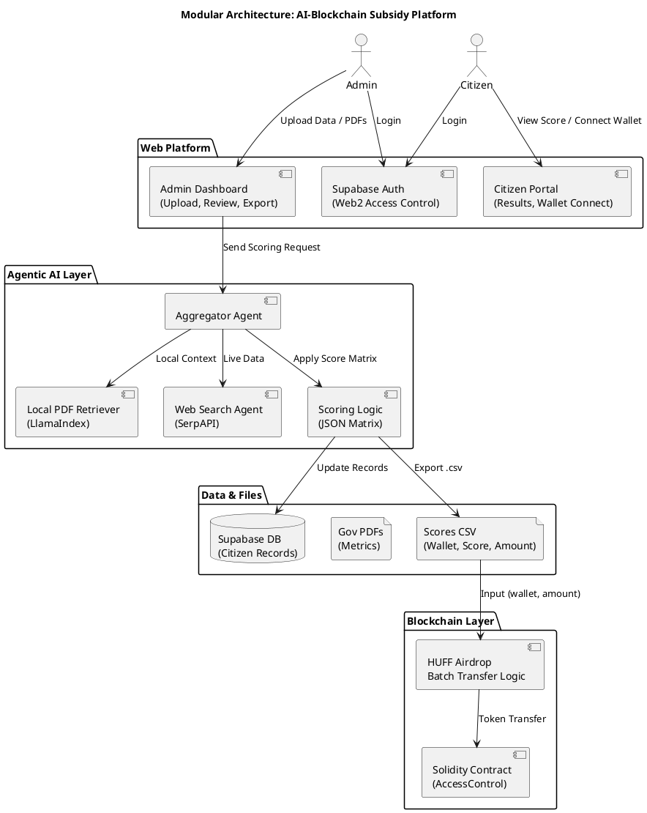

# 📚 Knowledge Base: AI-Blockchain Subsidy Distribution Platform

This document is a complete knowledge base for the Claude Code team working on the AI-powered blockchain-based subsidy distribution system. It contains architecture, tech stack, deployment guides, terminal commands, and project structure.

---

## 📦 Project Overview

An agentic RAG-powered platform to automate subsidy distribution using open-source AI models, Supabase, and smart contracts (Solidity + HUFF). Citizens are scored via AI agents, and subsidies are airdropped through optimized smart contracts.

---

## 🧩 Modular Architecture (Clean & Understandable)

| Module                 | Description                                                       |
| ---------------------- | ----------------------------------------------------------------- |
| Authentication & Roles | Web2 login (Supabase), on-chain AccessControl for Admin/Citizen   |
| Admin Dashboard        | Upload citizen data & PDFs, view scores, export CSV               |
| Agentic RAG Engine     | Multi-agent AI (local PDFs + web search) → score computation      |
| Scoring System         | Scoring matrix logic, DB updates, `.csv` generation               |
| Blockchain Layer       | Smart contracts (Solidity + HUFF) for access control and airdrops |
| Citizen Portal         | View eligibility, connect wallet, receive tokens                  |

---

## ✅ Architecture Diagram (PlantUML)



---

## 🛠️ Tech Stack

| Layer        | Tools                                     |
| ------------ | ----------------------------------------- |
| AI Engine    | LangChain, LangGraph, LlamaIndex, LLaMA 3 |
| Backend      | FastAPI / Node.js                         |
| Vector DB    | ChromaDB / pgvector                       |
| Frontend     | React or Next.js, Supabase UI             |
| Auth & DB    | Supabase (Postgres + Auth)                |
| Blockchain   | Solidity + HUFF + Foundry                 |
| Search Agent | SerpAPI or Tavily                         |

---

## 🔧 Development Tools

| Tool               | What It Does                 | Notes                     |
| ------------------ | ---------------------------- | ------------------------- |
| `Vite` + `React`   | Frontend UI & routing        | `npm create vite@latest`  |
| `Supabase`         | Auth (email/password) + DB   | Define roles (`is_admin`) |
| `FastAPI`          | Agent scoring system         | Python, LangChain         |
| `Foundry`          | Contract deploy/test         | Deploy airdrop on testnet |
| `Remix` (optional) | Quick Solidity UI tests      | Good for prototyping only |
| `Vercel`           | Host frontend (free)         | Connect GitHub repo       |
| `Render`           | Host backend API (free tier) | For FastAPI backend       |

---

## 🕒 Timeline (10 Weeks / 150 Hours)

| Week | Focus                                     | Estimated Hours |
| ---- | ----------------------------------------- | --------------- |
| 1    | Setup Supabase, GitHub, Wallets           | 10 hrs          |
| 2    | Admin Dashboard UI + Auth                 | 12 hrs          |
| 3    | Citizen Portal UI + Auth                  | 10 hrs          |
| 4    | AI Agent Setup (LangChain, LlamaIndex)    | 15 hrs          |
| 5    | Web Search Tool + Scoring Agent           | 15 hrs          |
| 6    | Score Matrix Logic + CSV Export           | 15 hrs          |
| 7    | Solidity Contract (AccessControl)         | 12 hrs          |
| 8    | HUFF Batch Airdrop Contract               | 15 hrs          |
| 9    | Integration Testing + Wallet Interactions | 20 hrs          |
| 10   | Polish, Documentation, Report, Deployment | 16 hrs          |

---

## 💰 Budget Estimation

| Item                      | Cost (USD)       |
| ------------------------- | ---------------- |
| Supabase                  | Free             |
| Open-source LLMs          | Free             |
| SerpAPI/Tavily Web Search | \$20 (estimated) |
| Domain (optional)         | \$10             |
| Testnet Gas (Sepolia)     | \$10             |
| Total                     | \~\$40           |

---

## 🧱 Project Directory (Monorepo)

Create the structure using:

```bash
mkdir -p gov-subsidy-platform/{frontend,backend,contracts,data,scripts,docs} && \
cd gov-subsidy-platform && \
touch README.md .gitignore .env.example && \
touch frontend/README.md backend/README.md contracts/README.md
```

Resulting structure:

```
gov-subsidy-platform/
├── frontend/
├── backend/
├── contracts/
├── data/
├── scripts/
├── docs/
├── .env.example
├── .gitignore
└── README.md
```

---

## 🧰 WSL2 Dev Setup (Recommended)

```bash
sudo apt update && sudo apt upgrade -y
sudo apt install curl git unzip build-essential pkg-config libssl-dev -y
curl -L https://foundry.paradigm.xyz | bash
foundryup

# HUFF install
sudo apt install cargo
cargo install --git https://github.com/huff-language/huff-rs.git --locked

# Node
curl -fsSL https://deb.nodesource.com/setup_20.x | sudo -E bash -
sudo apt install -y nodejs
npm install -g yarn bun

# Python + LangChain
sudo apt install python3 python3-pip python3-venv -y
python3 -m venv venv
source venv/bin/activate
pip install fastapi langchain llama-index
```

---

## 🔗 Deployment Plan (Live URL Access)

| Component      | Hosting Option   | URL Format                         |
| -------------- | ---------------- | ---------------------------------- |
| Frontend       | Vercel (Free)    | `https://project-name.vercel.app`  |
| Backend API    | Render / Railway | `https://api.render.com/score`     |
| Smart Contract | Sepolia Testnet  | `https://sepolia.etherscan.io/...` |
| Database/Auth  | Supabase         | Internal                           |

---

## ✅ Final Deliverables

* ✅ Working frontend (Vercel hosted)
* ✅ Working backend AI API
* ✅ Supabase DB and Auth
* ✅ Testnet deployed smart contract (Sepolia)
* ✅ `.csv` generation and batch airdrop
* ✅ Documentation + demo video