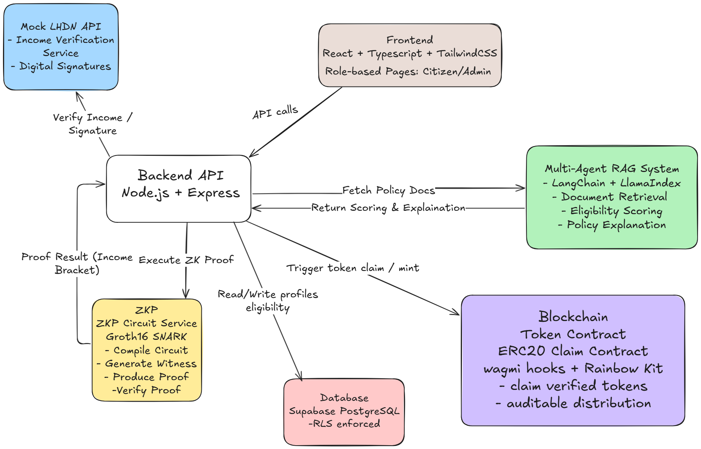

## A Multi-Agent RAG System for Auditable Token Distribution

**Project Type:** Final Year Project (FYP)
**Technologies:** React, TypeScript, TailwindCSS, Supabase, Node.js, Express, ZK-SNARK (Groth16), Circom, Solidity (ERC20), Mock API (Swagger UI), FastAPI

---

## Table of Contents

1. [Project Overview](#project-overview)
2. [Core Features](#core-features)
3. [Architecture](#architecture)
4. [Demo Flow](#demo-flow)
5. [Installation & Setup](#installation--setup)
6. [Future Work](#future-work)
7. [License](#license)

---

## Project Overview

This project implements a **multi-agent RAG (Retrieval-Augmented Generation) system** integrated with **zero-knowledge proofs (ZKP)** to enable **auditable and privacy-preserving token distribution**. The system allows users to prove their eligibility for a token-based subsidy (or scholarship) **without revealing sensitive income data**.

Key goals:

* Showcase **technical strength** in full-stack development, ZKP, and multi-agent AI frameworks.
* Provide a **privacy-preserving, auditable workflow** for conditional token distribution.
* Deliver a **reusable system** suitable for educational or NGO contexts.

---

## Core Features

* **Front-end**:

  * React + TypeScript + Vite
  * TailwindCSS styling and Lucide React icons
  * Role-based pages: Citizen, Admin, ZK Demo
  * Real-time ZK proof display and status badges

* **Back-end**:

  * Node.js + Express servers for Mock LHDN API and ZK circuit service
  * Supabase for user authentication and database storage
  * Row-Level Security (RLS) ensures users can only access their own profiles

* **Zero-Knowledge Proof (ZKP)**:

  * Groth16 SNARKs implemented in Circom
  * Income classification without revealing exact income
  * Proof verification via backend service

* **Token Distribution (Planned / Minimal Demo)**:

  * ERC20 / claim contract for token issuance
  * End-to-end demonstration of claim after ZKP verification
  * Auditable workflow recorded on blockchain or local testnet

* **Multi-Agent / RAG System (Planned)**:

  * AI agents can analyze policy documents and assist eligibility scoring
  * Supports Retrieval-Augmented Generation for automated decision-making

---

## Architecture



**Key Notes:**

* ZKP allows users to prove income bracket eligibility **without revealing exact figures**.
* Mock LHDN API simulates a trusted income source for the proof system.
* Multi-agent RAG system planned to automate policy scoring (AI integration).

---

## Demo Flow

1. **Register / Login** using Supabase Auth
2. **Fill Profile** (name, date of birth, gender, wallet address, household info)
3. **IC Verification** → Backend retrieves income data from Mock LHDN
4. **ZK Proof Generation** → Generates proof for income bracket (e.g., B1-T2)
5. **View Eligibility** → Verified bracket shown in front-end without revealing actual income
6. **Token Claim (Demo)** → Send claim transaction to local/testnet contract (optional)

---

## Installation & Setup

**Prerequisites:**

* Node.js >= 20
* npm >= 9
* Docker (optional, for local DB)

**Clone the repository:**

```bash
git clone https://github.com/BLTC-520/gov-subsidy-platform.git
cd gov-subsidy-platform
```

**Install dependencies:**

```bash
# Frontend
cd frontend
npm install
npm run dev

# Backend (Mock LHDN + ZK service)
cd ../backend/mock-lhdn-api
npm install
npm start

cd ../zk-service
npm install
npm start

root -> ./startallservices.sh
```

---

## Future Work

* Integrate AI / RAG for automatic policy analysis and eligibility scoring
* Expand blockchain integration for real-world auditable token distribution (will use Foundry)
* Deploy system for real scholarship / subsidy pilot projects

---

## License

MIT License


