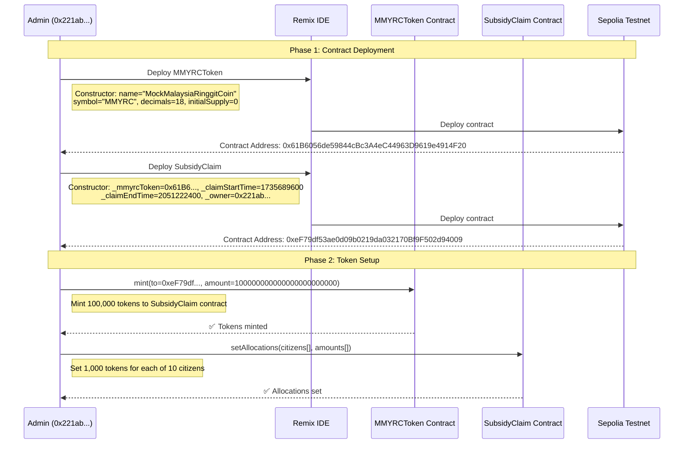
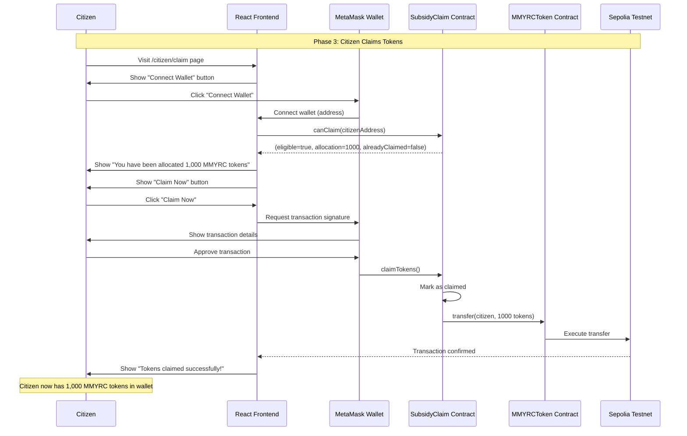

# Government Subsidy Platform - Sequence Diagram

## 🏗️ **Deployment & Setup Phase**

## 🎯 **Citizen Claiming Phase**

## 📋 **System Architecture Summary**

### **Contracts Created:**
1. **MMYRCToken** (`0x61B6056de59844cBc3A4eC44963D9619e4914F20`)
   - ERC-20 token contract
   - Max supply: 1,000,000 tokens
   - Owner: Admin address

2. **SubsidyClaim** (`0xeF79df53ae0d09b0219da032170Bf9F502d94009`)
   - Manages token allocations and claims
   - Holds 100,000 tokens for distribution
   - Owner: Admin address

### **Key Interactions:**
1. **Admin mints** 100,000 tokens to SubsidyClaim
2. **Admin sets** 1,000 token allocations for 10 citizens
3. **Citizens connect** wallets via RainbowKit
4. **Citizens claim** their allocated tokens
5. **Tokens transfer** from SubsidyClaim to citizen wallets

### **Frontend Integration:**
- **RainbowKit** for wallet connection
- **Wagmi hooks** for smart contract interaction
- **Real-time** allocation checking and claiming
- **Sepolia testnet** integration

### **Final State:**
- ✅ 100,000 tokens minted
- ✅ 10,000 tokens allocated (10 citizens × 1,000 each)
- ✅ 90,000 tokens remaining for future allocations
- ✅ Citizens can claim their 1,000 MMYRC tokens