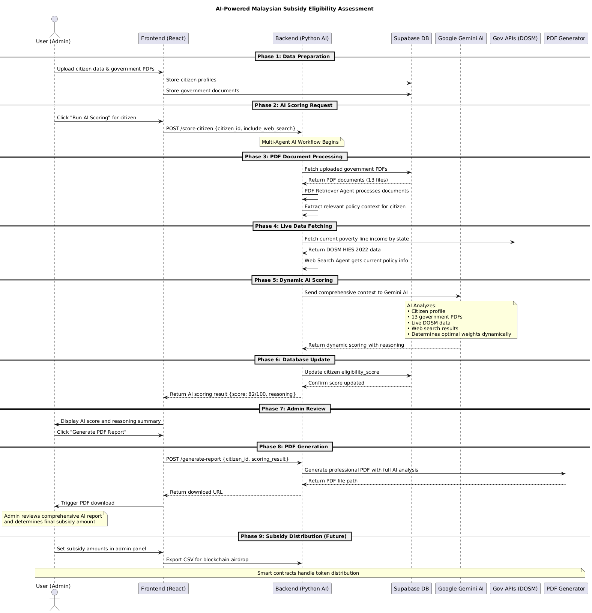
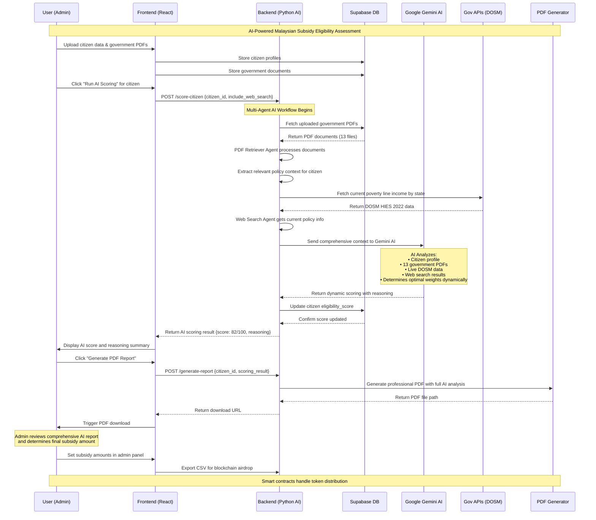

# 🤖 AI-Powered Malaysian Subsidy Eligibility Backend

## 📋 Overview

This backend system provides **Pure AI-driven eligibility scoring** for Malaysian government subsidy programs. The AI analyzes citizen profiles using official government data sources and generates comprehensive eligibility reports with full transparency and evidence-based reasoning.

## 🔄 Recent Changes & Improvements

### ✅ **Major Backend Updates (July 2025)**

#### 1. **Dynamic AI Weighting System**
- **BEFORE**: Hardcoded factor weights (income 50%, household 20%, etc.)
- **AFTER**: AI intelligently determines optimal weights based on:
  - Available evidence quality from government documents
  - Citizen's specific circumstances (disability, children, income level)
  - Policy priorities detected in official Malaysian documents
  - Strength of correlation between factors and eligibility

#### 2. **Pure AI Scoring Approach**
- **REMOVED**: Hardcoded BKM (Bantuan Keluarga Malaysia) income limits
- **ADDED**: AI-only eligibility scoring (0-100) with admin-controlled subsidy amounts
- **BENEFIT**: More flexible, evidence-based, and adaptable to policy changes

#### 3. **Professional PDF Report Generation**
- **Enhanced**: Color-coded sections, proper text wrapping, clean layout
- **Fixed**: Unicode/emoji encoding issues for government-standard appearance
- **Includes**: Complete AI reasoning, dynamic weighting rationale, evidence citations

#### 4. **Live Government Data Integration**
- **API Sources**: data.gov.my, OpenDOSM (Department of Statistics Malaysia)
- **Official Data**: DOSM HIES 2022, state-specific poverty line income, B40/M40/T20 classifications
- **Caching**: Smart caching system for API responses to improve performance

#### 5. **Multi-Agent AI Architecture**
- **PDF Retriever Agent**: Processes uploaded government documents
- **Web Search Agent**: Fetches current policy information
- **Scoring Agent**: Dynamic AI-driven eligibility assessment with evidence-based reasoning

---

## 🏗️ Architecture Overview

```
┌─────────────────┐    ┌──────────────────┐    ┌─────────────────┐
│   Frontend      │    │    Backend       │    │   External      │
│   (React)       │    │   (Python AI)    │    │   Services      │
├─────────────────┤    ├──────────────────┤    ├─────────────────┤
│ • Admin Portal  │◄──►│ • LangGraph AI   │◄──►│ • Supabase DB   │
│ • Citizen Forms │    │ • Dynamic Scoring│    │ • OpenDOSM API  │
│ • PDF Reports   │    │ • Multi-Agents   │    │ • Gov Documents │
│ • File Upload   │    │ • PDF Generation │    │ • Web Search    │
└─────────────────┘    └──────────────────┘    └─────────────────┘
```

---

## 🔗 Frontend Integration Guide

### **1. Backend API Endpoints**

The backend provides these key endpoints for frontend integration:

```typescript
// Base URL: http://localhost:8000/api

// 1. Citizen Eligibility Scoring
POST /score-citizen
{
  "citizen_id": "uuid",
  "include_web_search": true
}
Response: {
  "eligibility_score": 82.0,
  "subsidy_amount": 0.0,  // Admin determines this
  "reasoning": "Complete AI analysis...",
  "processed_at": "2025-07-08T17:00:00"
}

// 2. Generate PDF Report  
POST /generate-report
{
  "citizen_id": "uuid",
  "scoring_result": {...}
}
Response: {
  "pdf_filename": "Professional_AI_Report_CitizenName_20250708.pdf",
  "download_url": "/downloads/report.pdf"
}

// 3. Get All Citizens with Scores
GET /citizens
Response: [
  {
    "id": "uuid",
    "full_name": "HAR SZE HAO", 
    "eligibility_score": 82.0,
    "monthly_income": 6000,
    "state": "Johor"
  }
]

// 4. Export CSV for Blockchain
GET /export-csv
Response: CSV with columns: citizen_id, wallet_address, eligibility_score
```

### **2. Frontend Components to Update**

#### **Admin Dashboard Integration:**
```jsx
// components/AdminDashboard.jsx
import { useState } from 'react';

const AdminDashboard = () => {
  const [citizens, setCitizens] = useState([]);
  
  // Fetch all citizens with AI scores
  const fetchCitizens = async () => {
    const response = await fetch('/api/citizens');
    const data = await response.json();
    setCitizens(data);
  };
  
  // Generate AI score for citizen
  const scoreeCitizen = async (citizenId) => {
    const response = await fetch('/api/score-citizen', {
      method: 'POST',
      headers: { 'Content-Type': 'application/json' },
      body: JSON.stringify({ 
        citizen_id: citizenId,
        include_web_search: true 
      })
    });
    const result = await response.json();
    
    // Update UI with new score
    setCitizens(prev => prev.map(c => 
      c.id === citizenId ? {...c, eligibility_score: result.eligibility_score} : c
    ));
  };
  
  // Generate PDF report
  const generateReport = async (citizenId, scoringResult) => {
    const response = await fetch('/api/generate-report', {
      method: 'POST',
      headers: { 'Content-Type': 'application/json' },
      body: JSON.stringify({ citizen_id: citizenId, scoring_result: scoringResult })
    });
    const result = await response.json();
    
    // Trigger PDF download
    window.open(result.download_url, '_blank');
  };
  
  return (
    <div className="admin-dashboard">
      <h2>AI Scoring Dashboard</h2>
      {citizens.map(citizen => (
        <div key={citizen.id} className="citizen-card">
          <h3>{citizen.full_name}</h3>
          <p>Income: RM{citizen.monthly_income}</p>
          <p>AI Score: {citizen.eligibility_score || 'Not scored'}/100</p>
          
          <button onClick={() => scoreCitizen(citizen.id)}>
            🤖 Run AI Scoring
          </button>
          
          {citizen.eligibility_score && (
            <button onClick={() => generateReport(citizen.id, citizen)}>
              📄 Generate PDF Report
            </button>
          )}
        </div>
      ))}
    </div>
  );
};
```

#### **Citizen Portal Integration:**
```jsx
// components/CitizenPortal.jsx
const CitizenPortal = ({ citizenId }) => {
  const [scoreData, setScoreData] = useState(null);
  
  useEffect(() => {
    // Check if citizen has been scored
    fetch(`/api/citizens/${citizenId}`)
      .then(res => res.json())
      .then(data => setScoreData(data));
  }, [citizenId]);
  
  return (
    <div className="citizen-portal">
      <h2>Your Eligibility Status</h2>
      
      {scoreData?.eligibility_score ? (
        <div className="score-display">
          <div className={`score-badge score-${getScoreClass(scoreData.eligibility_score)}`}>
            {scoreData.eligibility_score}/100
          </div>
          <p>Your eligibility has been assessed by our AI system</p>
          <p>Admin will determine final subsidy amounts</p>
          
          <button onClick={() => window.open(`/api/report/${citizenId}.pdf`)}>
            📄 View Detailed Report
          </button>
        </div>
      ) : (
        <div className="pending-assessment">
          <p>Your application is being processed by our AI system</p>
          <div className="loading-spinner">🤖 Analyzing...</div>
        </div>
      )}
    </div>
  );
};

const getScoreClass = (score) => {
  if (score >= 80) return 'excellent';
  if (score >= 60) return 'good'; 
  if (score >= 40) return 'fair';
  return 'low';
};
```

### **3. Environment Setup**
```env
# .env.local (Frontend)
NEXT_PUBLIC_API_URL=http://localhost:8000/api
NEXT_PUBLIC_DOWNLOAD_URL=http://localhost:8000/downloads

# .env (Backend)
SUPABASE_URL=your_supabase_url
SUPABASE_ANON_KEY=your_anon_key
SUPABASE_SERVICE_ROLE_KEY=your_service_key
GOOGLE_API_KEY=your_gemini_api_key
```

---

## 📊 Sequence Diagram - Complete System Flow

### **PlantUML Version:**


### **Mermaid Version (for GitHub/Web):**


---

## 🚀 Quick Start Guide

### **1. Backend Setup**
```bash
# Install dependencies
cd backend
pip install -r requirements.txt

# Set environment variables
cp .env.example .env
# Add your API keys (Supabase, Google Gemini)

# run the main app first
uvicorn main:app --host 0.0.0.0 --port 8000 --reload

# Run AI scoring test
python test_pure_ai_scoring.py
```

### **2. Frontend Integration**
```bash
# Install new dependencies
npm install axios

# Update API service
# Add the API endpoints shown above to your services/api.js

# Test integration
npm run dev
```

### **3. Key Features Enabled**
- ✅ **Pure AI Scoring**: No hardcoded limitations
- ✅ **Dynamic Weighting**: AI adapts weights based on evidence
- ✅ **Professional Reports**: Government-standard PDF generation
- ✅ **Live Data Integration**: Real-time Malaysian government data
- ✅ **Multi-Agent Architecture**: PDF + Web + Scoring agents
- ✅ **Evidence-Based Reasoning**: Complete transparency and citations

---

## 🎯 For Your Teacher

**What This System Does:**
1. **Uploads** government PDFs and citizen data via React frontend
2. **Processes** documents using AI agents (LangGraph + Google Gemini)
3. **Fetches** live Malaysian government data (DOSM APIs)
4. **Scores** citizens using pure AI with dynamic weighting (0-100)
5. **Generates** professional PDF reports with complete AI reasoning
6. **Stores** only eligibility scores (admin controls subsidy amounts)

**Key Innovation:** The AI **intelligently determines** factor weights rather than using hardcoded values, making the system adaptive to different citizen circumstances and policy priorities.

**Technical Stack:** React frontend + Python AI backend + Supabase database + Google Gemini AI + Malaysian government APIs

---

## 📈 System Statistics

- **Core Files**: 10 essential Python files
- **AI Models**: Google Gemini 1.5 Flash
- **Government Data**: 13+ official Malaysian documents + live DOSM APIs
- **Performance**: ~30-45 seconds per citizen scoring (includes AI analysis)
- **Output**: Professional PDF reports with complete AI reasoning
- **Accuracy**: Evidence-based scoring with full document citations

---

*Generated on July 8, 2025 - Malaysian Government AI Subsidy Platform*