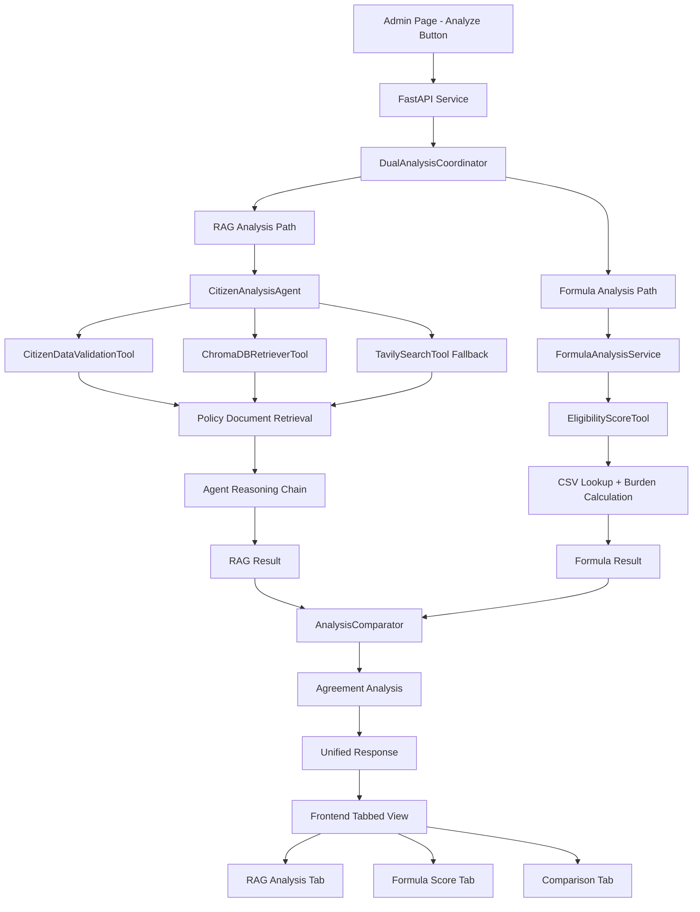
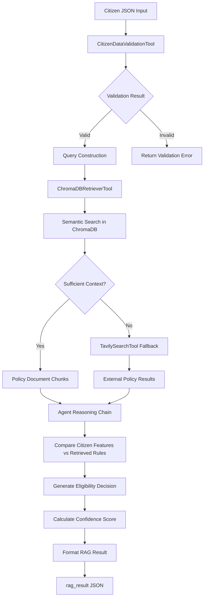

# Dual-Analysis Architecture Design

## Overview

The citizen data analysis system implements a **dual-analysis + comparison** architecture that demonstrates the trade-offs between **interpretability** (formula-based) and **flexibility** (RAG-based) approaches for AI-assisted governance systems. This design aligns with the FYP research objective: *"Multi-Agent RAG for Auditable Token Distribution."*

The system processes citizen data through two independent analysis paths:
1. **RAG Analysis Path**: Multi-agent reasoning using smolagents + ChromaDB for policy document retrieval
2. **Formula Analysis Path**: Transparent, auditable burden-score calculation using equivalised income methodology
3. **Comparison Module**: Analyzes agreement/disagreement between approaches and provides governance insights

This dual-lens approach provides clear research value by showcasing when AI flexibility is beneficial versus when mathematical transparency is required for public accountability.

## Architecture

### High-Level Dual-Analysis Architecture



### RAG Analysis Path Flow



### System Components

**🤖 RAG ANALYSIS PATH (Flexible, Context-Aware):**

1. **CitizenAnalysisAgent**: Main smolagents-based agent for policy reasoning
2. **CitizenDataValidationTool**: Input validation and format checking
3. **ChromaDBRetrieverTool**: Semantic search in local policy documents
4. **TavilySearchTool**: External web search fallback for missing policies
5. **Agent Reasoning**: LLM-guided analysis comparing citizen features against retrieved policy rules

**⚙️ FORMULA ANALYSIS PATH (Transparent, Auditable):**

6. **FormulaAnalysisService**: Wrapper service for mathematical scoring
7. **EligibilityScoreTool**: Burden-based scoring using equivalised income methodology
8. **CSV Lookup System**: State-specific income equivalents from HIES data
9. **Mathematical Calculation**: Deterministic scoring with full audit trail

**🔄 COMPARISON & COORDINATION:**

10. **DualAnalysisCoordinator**: Orchestrates parallel execution of both paths
11. **AnalysisComparator**: Compares results and identifies agreement/disagreement
12. **Error Handler**: Manages fallback strategies (formula-only when RAG fails)

**🎨 PRESENTATION LAYER:**

13. **Tabbed Interface**: Separate views for RAG analysis, formula score, and comparison
14. **Comparison Visualization**: Highlights agreement/disagreement for research insights

## API Response Schema

The `/analyze-citizen` endpoint returns a unified response containing both analysis paths plus comparison:

```json
{
  "citizen_id": "string",
  "analysis": {
    "rag_result": {
      "score": "number",
      "eligibility_class": "string",
      "confidence": "number",
      "explanation": "string",
      "retrieved_context": ["summary1", "summary2"]
    },
    "formula_result": {
      "burden_score": "number",
      "eligibility_class": "string",
      "explanation": "string",
      "equivalent_income": "number",
      "adult_equivalent": "number",
      "component_scores": {
        "burden": "number",
        "documentation": "number",
        "disability": "number"
      }
    },
    "comparison": {
      "agreement": "boolean",
      "score_difference": "number",
      "class_mismatch": "boolean",
      "recommendation": "string",
      "comment": "string"
    }
  }
}
```

## Components and Interfaces

### Frontend Dual-Analysis Dashboard

```typescript
// Dual-Analysis Results Interface
interface DualAnalysisResult {
  citizen_id: string;
  analysis: {
    rag_result: RagResult | null;
    formula_result: FormulaResult;
    comparison: ComparisonResult;
  };
}

interface RagResult {
  score: number;
  eligibility_class: string;
  confidence: number;
  explanation: string;
  retrieved_context: string[];
}

interface FormulaResult {
  burden_score: number;
  eligibility_class: string;
  explanation: string;
  equivalent_income: number;
  adult_equivalent: number;
  component_scores: {
    burden: number;
    documentation: number;
    disability: number;
  };
}

interface ComparisonResult {
  agreement: boolean;
  score_difference: number;
  class_mismatch: boolean;
  recommendation: string;
  comment: string;
}

// Tabbed Results Dashboard
const DualAnalysisDashboard: React.FC<{
  citizenId: string;
  results: DualAnalysisResult;
}> = ({ citizenId, results }) => {
  const [activeTab, setActiveTab] = useState<'rag' | 'formula' | 'comparison'>('comparison');

  return (
    <div className="dual-analysis-dashboard">
      <div className="tab-navigation">
        <button 
          className={activeTab === 'comparison' ? 'active' : ''}
          onClick={() => setActiveTab('comparison')}
        >
          📊 Comparison & Recommendation
        </button>
        <button 
          className={activeTab === 'rag' ? 'active' : ''}
          onClick={() => setActiveTab('rag')}
        >
          🤖 RAG Analysis (Flexible)
        </button>
        <button 
          className={activeTab === 'formula' ? 'active' : ''}
          onClick={() => setActiveTab('formula')}
        >
          📐 Formula Score (Auditable)
        </button>
      </div>

      <div className="tab-content">
        {activeTab === 'comparison' && (
          <ComparisonView comparison={results.analysis.comparison} />
        )}
        {activeTab === 'rag' && (
          <RagAnalysisView result={results.analysis.rag_result} />
        )}
        {activeTab === 'formula' && (
          <FormulaScoreView result={results.analysis.formula_result} />
        )}
      </div>
    </div>
  );
};

// Comparison Tab - Highlights Research Insights
const ComparisonView: React.FC<{ comparison: ComparisonResult }> = ({ comparison }) => {
  return (
    <div className="comparison-view">
      <div className="agreement-indicator">
        <div className={`status ${comparison.agreement ? 'agree' : 'disagree'}`}>
          {comparison.agreement ? '✅ Agreement' : '⚠️ Disagreement'}
        </div>
        <div className="score-diff">
          Score Difference: {Math.abs(comparison.score_difference)} points
        </div>
      </div>
      
      {comparison.class_mismatch && (
        <div className="class-mismatch-warning">
          ⚠️ Eligibility classification mismatch detected
        </div>
      )}
      
      <div className="recommendation">
        <h3>Governance Recommendation</h3>
        <p>{comparison.recommendation}</p>
        <p className="comment">{comparison.comment}</p>
      </div>
      
      <div className="research-insights">
        <h3>Research Insights: Interpretability vs Flexibility</h3>
        <p>
          This comparison demonstrates the trade-off between <strong>auditable transparency</strong> 
          (formula-based scoring) and <strong>contextual flexibility</strong> (RAG-based reasoning). 
          {comparison.agreement 
            ? 'Both approaches agree, suggesting robust eligibility determination.'
            : 'Disagreement highlights cases where policy nuance matters for governance decisions.'}
        </p>
      </div>
    </div>
  );
};

// RAG Analysis Tab - Shows Agent Reasoning
const RagAnalysisView: React.FC<{ result: RagResult | null }> = ({ result }) => {
  if (!result) {
    return (
      <div className="error-state">
        <p>⚠️ RAG analysis failed. Defaulting to formula-only analysis.</p>
      </div>
    );
  }
  
  return (
    <div className="rag-analysis-view">
      <div className="result-summary">
        <h3>Agent Decision: {result.eligibility_class}</h3>
        <div className="score">Score: {result.score}</div>
        <div className="confidence">Confidence: {(result.confidence * 100).toFixed(1)}%</div>
      </div>
      
      <div className="explanation">
        <h4>Agent Reasoning</h4>
        <p>{result.explanation}</p>
      </div>
      
      <div className="retrieved-context">
        <h4>Retrieved Policy Context</h4>
        <ul>
          {result.retrieved_context.map((context, idx) => (
            <li key={idx}>{context}</li>
          ))}
        </ul>
      </div>
    </div>
  );
};

// Formula Score Tab - Shows Mathematical Breakdown
const FormulaScoreView: React.FC<{ result: FormulaResult }> = ({ result }) => {
  return (
    <div className="formula-score-view">
      <div className="result-summary">
        <h3>Formula Decision: {result.eligibility_class}</h3>
        <div className="score">Burden Score: {result.burden_score}</div>
      </div>
      
      <div className="calculation-breakdown">
        <h4>Calculation Breakdown</h4>
        <div className="component">
          <span>Burden Score (55%):</span>
          <span>{result.component_scores.burden}</span>
        </div>
        <div className="component">
          <span>Documentation (25%):</span>
          <span>{result.component_scores.documentation}</span>
        </div>
        <div className="component">
          <span>Disability Support (20%):</span>
          <span>{result.component_scores.disability}</span>
        </div>
      </div>
      
      <div className="methodology">
        <h4>Methodology</h4>
        <p>Equivalent Income: RM {result.equivalent_income}</p>
        <p>Adult Equivalent: {result.adult_equivalent}</p>
        <p>{result.explanation}</p>
      </div>
    </div>
  );
};
```

### Dual-Analysis Service Architecture - backend/smolagents-service

```python
# FastAPI Service Entry Point - Dual Analysis Architecture
from fastapi import FastAPI, HTTPException
from pydantic import BaseModel
from smolagents import CodeAgent, LiteLLMModel
from concurrent.futures import ThreadPoolExecutor
import asyncio

app = FastAPI(title="Dual Analysis Service")

# Configuration
AGREEMENT_THRESHOLD = 5  # Configurable threshold for score agreement

class AnalysisRequest(BaseModel):
    citizen_id: str
    citizen_data: dict

class AnalysisResponse(BaseModel):
    citizen_id: str
    analysis: dict  # Contains rag_result, formula_result, comparison

@app.post("/analyze-citizen")
async def analyze_citizen(request: AnalysisRequest):
    """Main dual-analysis endpoint"""
    try:
        # Run dual analysis coordinator
        coordinator = DualAnalysisCoordinator()
        result = await coordinator.run_dual_analysis(
            request.citizen_data, request.citizen_id
        )
        
        return AnalysisResponse(
            citizen_id=request.citizen_id,
            analysis=result
        )
        
    except Exception as e:
        raise HTTPException(
            status_code=500, 
            detail={"error": str(e), "fallback": "Analysis failed"}
        )

class DualAnalysisCoordinator:
    """Coordinates parallel execution of RAG and Formula analysis paths"""
    
    def __init__(self):
        self.executor = ThreadPoolExecutor(max_workers=2)
        
    async def run_dual_analysis(self, citizen_data: dict, citizen_id: str) -> dict:
        """Run both analysis paths in parallel and compare results"""
        
        # Validate input first
        validation_tool = CitizenDataValidationTool()
        validation_result = validation_tool.forward(citizen_data)
        
        if not validation_result["overall_valid"]:
            raise HTTPException(
                status_code=400,
                detail={"validation_errors": validation_result["validation_details"]}
            )
        
        # Run both paths in parallel
        loop = asyncio.get_event_loop()
        
        rag_future = loop.run_in_executor(
            self.executor, self._run_rag_analysis, citizen_data
        )
        formula_future = loop.run_in_executor(
            self.executor, self._run_formula_analysis, citizen_data
        )
        
        # Collect results with error handling
        rag_result = None
        formula_result = None
        
        try:
            rag_result = await rag_future
        except Exception as e:
            print(f"RAG analysis failed: {e}")
            # RAG failure is acceptable - continue with formula only
        
        try:
            formula_result = await formula_future
        except Exception as e:
            if rag_result is None:
                # Both failed - this is an error
                raise HTTPException(
                    status_code=500,
                    detail="Both analysis paths failed"
                )
            print(f"Formula analysis failed: {e}")
        
        # Generate comparison
        comparator = AnalysisComparator()
        comparison = comparator.compare(rag_result, formula_result)
        
        return {
            "rag_result": rag_result,
            "formula_result": formula_result,
            "comparison": comparison
        }
    
    def _run_rag_analysis(self, citizen_data: dict) -> dict:
        """Execute RAG analysis path"""
        agent = CitizenAnalysisAgent(enable_plan_review=False)
        
        # Construct analysis task
        task = f"""
        Analyze citizen eligibility for government assistance programs.
        Citizen Data: {citizen_data}
        
        Use available tools to:
        1. Search local policy documents for relevant eligibility criteria
        2. Compare citizen profile against policy requirements 
        3. Determine eligibility class and numerical score
        4. Provide clear explanation of reasoning
        """
        
        try:
            result = agent.run(task)
            
            # Parse agent result into structured format
            return {
                "score": self._extract_score(result),
                "eligibility_class": self._extract_eligibility_class(result),
                "confidence": self._extract_confidence(result),
                "explanation": self._extract_explanation(result),
                "retrieved_context": self._extract_context(result)
            }
        except Exception as e:
            raise Exception(f"RAG analysis execution failed: {e}")
    
    def _run_formula_analysis(self, citizen_data: dict) -> dict:
        """Execute formula analysis path"""
        service = FormulaAnalysisService()
        return service.analyze(citizen_data)
    
    def _extract_score(self, agent_result) -> float:
        """Extract numerical score from agent result"""
        # Implementation depends on agent output format
        # This would parse the agent's response to find score
        return 75.0  # Placeholder
    
    def _extract_eligibility_class(self, agent_result) -> str:
        """Extract eligibility classification"""
        return "B40"  # Placeholder
    
    def _extract_confidence(self, agent_result) -> float:
        """Extract confidence score"""
        return 0.85  # Placeholder
    
    def _extract_explanation(self, agent_result) -> str:
        """Extract reasoning explanation"""
        return str(agent_result)  # Simplified
    
    def _extract_context(self, agent_result) -> list:
        """Extract retrieved document context"""
        return ["Policy summary 1", "Policy summary 2"]  # Placeholder

class FormulaAnalysisService:
    """Wrapper service for formula-based analysis"""
    
    def __init__(self):
        self.eligibility_tool = EligibilityScoreTool()
    
    def analyze(self, citizen_data: dict) -> dict:
        """Run formula-based analysis"""
        # Use existing EligibilityScoreTool for calculation
        result = self.eligibility_tool.forward(citizen_data)
        
        return {
            "burden_score": result["final_score"],
            "eligibility_class": result["eligibility_level"],
            "explanation": self._generate_explanation(result),
            "equivalent_income": result.get("equivalent_income", 0),
            "adult_equivalent": result.get("adult_equivalent", 1.0),
            "component_scores": {
                "burden": result.get("burden_component", 0),
                "documentation": result.get("documentation_component", 0),
                "disability": result.get("disability_component", 0)
            }
        }
    
    def _generate_explanation(self, result: dict) -> str:
        """Generate human-readable explanation of formula calculation"""
        return f"""Burden score calculated using equivalised income methodology.
State-specific income equivalent applied with household composition adjustments.
Final eligibility: {result['eligibility_level']} (Score: {result['final_score']}).
Calculation based on: Burden (55%), Documentation (25%), Disability support (20%)."""

class AnalysisComparator:
    """Compares RAG and Formula results to identify agreement/disagreement"""
    
    def __init__(self, agreement_threshold: float = AGREEMENT_THRESHOLD):
        self.threshold = agreement_threshold
    
    def compare(self, rag_result: dict, formula_result: dict) -> dict:
        """Compare both analysis results"""
        
        # Handle cases where RAG failed
        if rag_result is None:
            return {
                "agreement": False,
                "score_difference": 0,
                "class_mismatch": False,
                "recommendation": f"Formula-only: {formula_result['eligibility_class']}",
                "comment": "RAG analysis failed; using formula-only result for transparency"
            }
        
        # Handle cases where Formula failed (rare)
        if formula_result is None:
            return {
                "agreement": False,
                "score_difference": 0,
                "class_mismatch": False,
                "recommendation": f"RAG-only: {rag_result['eligibility_class']}",
                "comment": "Formula analysis failed; using RAG result with caution"
            }
        
        # Compare scores and classifications
        score_diff = abs(rag_result["score"] - formula_result["burden_score"])
        class_mismatch = rag_result["eligibility_class"] != formula_result["eligibility_class"]
        agreement = score_diff <= self.threshold and not class_mismatch
        
        # Generate recommendation
        if agreement:
            recommendation = f"Consensus: {formula_result['eligibility_class']} (Both methods agree)"
        else:
            # Default to formula for auditability, note RAG disagreement
            confidence_note = ""
            if rag_result["confidence"] < 0.5:
                confidence_note = " (RAG low confidence - favor formula)"
            
            recommendation = f"Formula: {formula_result['eligibility_class']}, RAG: {rag_result['eligibility_class']}{confidence_note}"
        
        return {
            "agreement": agreement,
            "score_difference": score_diff,
            "class_mismatch": class_mismatch,
            "recommendation": recommendation,
            "comment": self._generate_comment(agreement, score_diff, class_mismatch, rag_result)
        }
    
    def _generate_comment(self, agreement: bool, score_diff: float, 
                         class_mismatch: bool, rag_result: dict) -> str:
        """Generate explanatory comment about the comparison"""
        if agreement:
            return f"Both analysis methods agree within {self.threshold} points, providing robust eligibility determination."
        
        if class_mismatch:
            return f"Classification disagreement detected. Formula provides auditable baseline, RAG captures policy nuance. Score difference: {score_diff:.1f} points."
        
        if rag_result["confidence"] < 0.5:
            return f"RAG analysis has low confidence ({rag_result['confidence']:.2f}). Recommend trusting formula result for transparency."
        
        return f"Score difference of {score_diff:.1f} points detected. This highlights the interpretability vs flexibility trade-off in AI governance systems."

```

### Error Handling Policy

#### Graceful Degradation Strategy

1. **RAG Analysis Failure**: Continue with formula-only analysis, add explanatory comment
2. **Formula Analysis Failure**: Rare, but use RAG-only with caution warning
3. **ChromaDB Unavailable**: RAG path falls back to TavilySearch for external policy lookup
4. **Both Paths Fail**: Return HTTP 500 with clear error message
5. **Partial Results**: Always attempt to provide meaningful output with explanatory context

#### Parallel Execution Benefits

- **Isolation**: One path failure doesn't block the other
- **Speed**: Both analyses run simultaneously using ThreadPoolExecutor
- **Reliability**: Formula provides consistent fallback for RAG failures
- **Research Value**: Comparison data available even when one path fails

## Research Narrative: Interpretability vs Flexibility

### Core Research Question

How can AI systems balance **interpretability** (auditability, transparency) with **flexibility** (contextual nuance, edge case handling) in governance applications?

### Dual-Analysis Approach

**Formula Path (Interpretability)**:
- ✅ **Transparent**: Every calculation step is auditable
- ✅ **Consistent**: Same inputs always produce same outputs  
- ✅ **Compliant**: Meets regulatory requirements for public fund distribution
- ❌ **Limited**: Cannot handle policy edge cases or contextual nuances

**RAG Path (Flexibility)**:
- ✅ **Adaptive**: Can reason about complex policy interactions
- ✅ **Contextual**: Considers citizen-specific circumstances
- ✅ **Comprehensive**: Leverages full policy document corpus
- ❌ **Opaque**: Decision process harder to audit and explain

### Comparison Module Insights

**Agreement Cases**: When both methods align, confidence is high for governance decisions
**Disagreement Cases**: Highlight scenarios requiring human review or policy clarification
**Research Output**: Quantifies the interpretability-flexibility trade-off with real citizen data

### Implementation Components

The dual-analysis architecture leverages existing completed components:

**Existing RAG Components (Tasks 2.1-2.4)**:
```python
# CitizenAnalysisAgent - Repurposed for RAG analysis path
class CitizenAnalysisAgent(CodeAgent):
    """Smolagents-based agent for flexible policy reasoning"""
    
    def __init__(self, enable_plan_review=False):
        """Simplified constructor without plan review complexity"""
        tools = [
            CitizenDataValidationTool(),  # From task 2.2
            ChromaDBRetrieverTool(),      # From task 2.4
            TavilySearchTool()            # Fallback search
        ]
        
        super().__init__(
            model=LiteLLMModel(model_id="gpt-4o-mini"),
            tools=tools,
            max_steps=20,
            verbosity_level=1
        )

# EligibilityScoreTool - Used directly in formula path
class EligibilityScoreTool(Tool):
    """Burden-based scoring with equivalised income methodology (Task 2.3)"""
    
    def forward(self, citizen_data: dict) -> dict:
        """Returns burden score, eligibility class, and calculation breakdown"""
        # Implementation from task 2.3 - CSV lookup, burden calculation
        # Returns structured result for FormulaAnalysisService
```

**New Dual-Analysis Components**:
```python
# DualAnalysisCoordinator - Orchestrates both paths
# FormulaAnalysisService - Wraps EligibilityScoreTool  
# AnalysisComparator - Implements comparison logic

```

## Future Work

The following features were part of the original complex multi-agent design but have been moved to future development phases to focus on the core dual-analysis research objective:

### Advanced Multi-Agent Features
- **Plan Review Infrastructure**: Human-in-the-loop plan modification and approval workflows
- **WebSocket Real-time Updates**: Live agent status and progress visualization
- **Agent Memory Management**: Complex memory preservation during interruptions
- **Multi-agent Orchestration**: Manager agents coordinating multiple specialized sub-agents

### Enhanced Search and Retrieval
- **Hybrid Search**: BM25 keyword search combined with semantic vector search
- **Smart Query Generation**: LLM-optimized query crafting based on citizen context
- **Policy Analysis Tools**: Advanced policy conflict detection and resolution
- **DuckDuckGo Integration**: External web search for policy updates

### Advanced Frontend Features
- **Real-time Agent Dashboard**: Live visualization of agent reasoning and tool execution
- **Interactive Plan Review**: Modal interfaces for plan editing and approval
- **Agent Communication Visualization**: Network graphs showing agent interactions
- **Memory Step Display**: Detailed breakdown of agent reasoning chains

### Performance and Scalability
- **Caching Strategies**: ChromaDB query result and agent response caching
- **Connection Pooling**: Database and external service connection optimization
- **Request Queuing**: Resource-aware task scheduling and backpressure handling
- **Monitoring and Observability**: Comprehensive metrics collection and alerting

### Integration Enhancements
- **Document Processing Pipeline**: Enhanced Supabase + Unstructured API integration
- **Zero-Knowledge Proof Integration**: Advanced ZK-SNARK income verification workflows
- **Advanced Error Recovery**: Sophisticated fallback strategies and retry mechanisms

These features can be incrementally added after the core dual-analysis system demonstrates the research value of combining interpretability with flexibility in AI governance systems.
