# Design Document

## Overview

The citizen data analysis system is a multi-agent reasoning platform built on smolagents that processes citizen data through intelligent eligibility review workflows. The system is implemented in the `backend/smolagents-service` directory and integrates with existing document preprocessing infrastructure (Supabase + Unstructured API), leverages ChromaDB for RAG document retrieval, and falls back to TavilySearch for external information when local documents are insufficient.

The system features a dedicated real-time multi-agent analysis dashboard that showcases the sophisticated agent orchestration through live visualization, making it ideal for FYP demonstrations.

## Architecture

### High-Level Architecture

```mermaid
graph TB
    A[Admin Page - Analyze Button] --> B[Main Backend API]
    B --> C[smolagents-service HTTP Call]
    C --> D[Multi-Agent Analysis Dashboard]
    D --> E[Real-Time Agent Orchestrator]
    E --> F[Agent Pool - ManagerAgent]
    F --> G[🤖 Data Analysis Agent]
    F --> H[🏛️ Policy Research Agent]
    F --> I[📊 Scoring Agent]
    G --> J[RetrieverTool - Local RAG]
    G --> K[TavilySearchTool - Web Search]
    H --> L[RetrieverTool - Local RAG]
    H --> M[TavilySearchTool - Web Search]
    I --> N[RetrieverTool - Local RAG]
    J --> O[Combined Knowledge Base]
    K --> O
    L --> O
    M --> O
    N --> O
    O --> P[Live Analysis Stream]
    P --> Q[Progressive Results Display]
    Q --> R[Eligibility Score Engine]
    R --> S[Comprehensive Analysis Report]

    D --> T[WebSocket Connection]
    T --> U[Real-Time Agent Status Updates]
    T --> V[Agent Communication Visualization]
    T --> W[Live Progress Indicators]
```



### System Components

**🤖 AGENT-BASED (Complex, Unpredictable):**

1. **Manager Agent**: Orchestrates workflow, handles failures, makes coordination decisions
2. **Policy Research Agent**: Interprets complex policies, handles edge cases, contextual analysis
3. **Human-in-the-Loop Controller**: Manages plan interruption, user interaction, and execution resumption

**⚙️ PREDETERMINED PROCESSES (Simple, Predictable):** 4. **Data Validation Service**: Rule-based income/demographic checking 5. **Scoring Calculator**: Mathematical weighted scoring algorithm 6. **Knowledge Retrieval Service**: Your existing RetrieverTool + TavilySearchTool 7. **Plan Display Service**: Formats and presents agent plans for user review

**🎨 PRESENTATION LAYER:** 8. **Multi-Agent Analysis Dashboard**: Real-time visualization of the hybrid system 9. **WebSocket Communication**: Live updates showing both agent reasoning and process execution 10. **Plan Review Interface**: Interactive UI for plan approval, modification, and cancellation

## Components and Interfaces

### Frontend Multi-Agent Analysis Dashboard

```typescript
// Multi-Agent Analysis Page Component
interface AnalysisDashboardProps {
  citizenId: string;
  citizenData: CitizenData;
}

interface AgentStatus {
  agentId: string;
  name: string;
  status: "idle" | "running" | "completed" | "error" | "waiting_approval";
  progress: number;
  currentTask: string;
  results?: AgentResult;
  confidence?: number;
  currentPlan?: AgentPlan;
}

interface AgentPlan {
  planId: string;
  agentId: string;
  planContent: string;
  createdAt: string;
  status: "pending_review" | "approved" | "modified" | "cancelled";
}

interface LiveAnalysisStream {
  timestamp: string;
  agentId: string;
  message: string;
  type:
    | "info"
    | "reasoning"
    | "communication"
    | "result"
    | "plan_created"
    | "plan_approved";
}

interface PlanReviewModalProps {
  plan: AgentPlan;
  onApprove: () => void;
  onModify: (modifiedPlan: string) => void;
  onCancel: () => void;
}

// Plan Review Modal Component
const PlanReviewModal = ({
  plan,
  onApprove,
  onModify,
  onCancel,
}: PlanReviewModalProps) => {
  const [isEditing, setIsEditing] = useState(false);
  const [editedPlan, setEditedPlan] = useState(plan.planContent);

  return (
    <div className="plan-review-modal">
      <div className="modal-header">
        <h3>Agent Plan Review - {plan.agentId}</h3>
        <span className="plan-timestamp">{plan.createdAt}</span>
      </div>

      <div className="plan-content">
        {isEditing ? (
          <textarea
            value={editedPlan}
            onChange={(e) => setEditedPlan(e.target.value)}
            className="plan-editor"
            rows={15}
          />
        ) : (
          <pre className="plan-display">{plan.planContent}</pre>
        )}
      </div>

      <div className="modal-actions">
        <button onClick={onApprove} className="btn-approve">
          ✓ Approve Plan
        </button>
        <button onClick={() => setIsEditing(!isEditing)} className="btn-modify">
          {isEditing ? "Preview" : "✏️ Modify Plan"}
        </button>
        {isEditing && (
          <button
            onClick={() => onModify(editedPlan)}
            className="btn-save-changes"
          >
            💾 Save Changes
          </button>
        )}
        <button onClick={onCancel} className="btn-cancel">
          ✕ Cancel
        </button>
      </div>
    </div>
  );
};

// Real-time Dashboard Features with Plan Review
const AnalysisDashboard = ({
  citizenId,
  citizenData,
}: AnalysisDashboardProps) => {
  const [agentStatuses, setAgentStatuses] = useState<AgentStatus[]>([]);
  const [analysisStream, setAnalysisStream] = useState<LiveAnalysisStream[]>(
    []
  );
  const [knowledgeStatus, setKnowledgeStatus] = useState<KnowledgeStatus>();
  const [finalResults, setFinalResults] = useState<AnalysisResult>();
  const [pendingPlan, setPendingPlan] = useState<AgentPlan | null>(null);
  const [showPlanReview, setShowPlanReview] = useState(false);

  // WebSocket connection for real-time updates
  useWebSocket("/api/analysis/stream", {
    onMessage: handleRealtimeUpdate,
  });

  const handlePlanApproval = async () => {
    if (pendingPlan) {
      await fetch(`/api/analysis/plans/${pendingPlan.planId}/approve`, {
        method: "POST",
      });
      setShowPlanReview(false);
      setPendingPlan(null);
    }
  };

  const handlePlanModification = async (modifiedPlan: string) => {
    if (pendingPlan) {
      await fetch(`/api/analysis/plans/${pendingPlan.planId}/modify`, {
        method: "POST",
        headers: { "Content-Type": "application/json" },
        body: JSON.stringify({ modifiedPlan }),
      });
      setShowPlanReview(false);
      setPendingPlan(null);
    }
  };

  const handlePlanCancellation = async () => {
    if (pendingPlan) {
      await fetch(`/api/analysis/plans/${pendingPlan.planId}/cancel`, {
        method: "POST",
      });
      setShowPlanReview(false);
      setPendingPlan(null);
    }
  };

  return (
    <div className="analysis-dashboard">
      <AgentVisualization agents={agentStatuses} />
      <LiveStreamPanel stream={analysisStream} />
      <KnowledgeStatusPanel status={knowledgeStatus} />
      <ProgressiveResults results={finalResults} />

      {showPlanReview && pendingPlan && (
        <PlanReviewModal
          plan={pendingPlan}
          onApprove={handlePlanApproval}
          onModify={handlePlanModification}
          onCancel={handlePlanCancellation}
        />
      )}
    </div>
  );
};
```

### Multi-Agent Service Architecture - backend/smolagents-service

```python
# FastAPI Service Entry Point with Plan Customization Support
from fastapi import FastAPI, WebSocket, HTTPException
from pydantic import BaseModel
from smolagents import CodeAgent, DuckDuckGoSearchTool, LiteLLMModel, PlanningStep, ToolCallingAgent
import asyncio

app = FastAPI(title="Smolagents Analysis Service")

class AnalysisRequest(BaseModel):
    citizen_id: str
    citizen_data: dict
    query: str
    enable_plan_review: bool = True
    planning_interval: int = 5

class AnalysisResponse(BaseModel):
    analysis_id: str
    status: str
    results: dict
    score: float
    plan_interactions: list

class PlanReviewRequest(BaseModel):
    plan_id: str
    action: str  # "approve", "modify", "cancel"
    modified_plan: str = None

# Global storage for active analysis sessions
active_sessions = {}

@app.post("/analyze-citizen")
async def analyze_citizen(request: AnalysisRequest):
    """Main service endpoint with plan customization support"""
    analysis_id = generate_analysis_id()

    # Create agent with plan customization if enabled
    if request.enable_plan_review:
        agent = create_agent_with_plan_review(analysis_id)
    else:
        agent = create_standard_agent()

    # Store session for plan review interactions
    active_sessions[analysis_id] = {
        "agent": agent,
        "request": request,
        "status": "running",
        "pending_plan": None
    }

    try:
        result = await run_analysis_with_interruption_support(
            agent, request.citizen_data, request.query, analysis_id
        )
        return AnalysisResponse(analysis_id=analysis_id, **result)
    except InterruptionException as e:
        # Analysis paused for plan review
        return AnalysisResponse(
            analysis_id=analysis_id,
            status="waiting_plan_review",
            results={},
            score=0.0,
            plan_interactions=[]
        )

@app.post("/analysis/{analysis_id}/plan-review")
async def handle_plan_review(analysis_id: str, review: PlanReviewRequest):
    """Handle plan approval, modification, or cancellation"""
    if analysis_id not in active_sessions:
        raise HTTPException(status_code=404, detail="Analysis session not found")

    session = active_sessions[analysis_id]
    agent = session["agent"]

    if review.action == "approve":
        # Resume execution with current plan
        result = await resume_agent_execution(agent, session["request"])
        return {"status": "approved", "result": result}

    elif review.action == "modify":
        # Update plan and resume
        update_agent_plan(agent, review.modified_plan)
        result = await resume_agent_execution(agent, session["request"])
        return {"status": "modified", "result": result}

    elif review.action == "cancel":
        # Terminate analysis
        agent.interrupt()
        del active_sessions[analysis_id]
        return {"status": "cancelled"}

@app.websocket("/ws/analysis/{analysis_id}")
async def websocket_endpoint(websocket: WebSocket, analysis_id: str):
    """Real-time updates including plan review notifications"""
    await websocket.accept()

    while analysis_id in active_sessions:
        session = active_sessions[analysis_id]

        # Send status updates
        await websocket.send_json({
            "type": "status_update",
            "status": session["status"],
            "agent_memory_steps": len(session["agent"].memory.steps)
        })

        # Send plan review requests
        if session.get("pending_plan"):
            await websocket.send_json({
                "type": "plan_review_required",
                "plan": session["pending_plan"]
            })

        await asyncio.sleep(1)

def create_agent_with_plan_review(analysis_id: str):
    """Create agent with step callbacks for plan interruption"""

    def interrupt_after_plan(memory_step, agent):
        """Step callback for plan review"""
        if isinstance(memory_step, PlanningStep):
            # Store plan for review
            active_sessions[analysis_id]["pending_plan"] = memory_step.plan
            active_sessions[analysis_id]["status"] = "waiting_plan_review"

            # Interrupt agent execution
            agent.interrupt()

    return CodeAgent(
        model=LiteLLMModel(
            model_id="gpt-4o-mini",
            api_key=os.environ["OPENAI_API_KEY"]
        ),
        tools=[
            DuckDuckGoSearchTool(),
            RetrieverTool(),  # Custom RAG tool
            CitizenAnalysisTool()  # Custom analysis tool
        ],
        planning_interval=5,
        step_callbacks={PlanningStep: interrupt_after_plan},
        max_steps=20,
        verbosity_level=1
    )

def create_standard_agent():
    """Create agent without plan review interruption"""
    return CodeAgent(
        model=LiteLLMModel(
            model_id="gpt-4o-mini",
            api_key=os.environ["OPENAI_API_KEY"]
        ),
        tools=[
            DuckDuckGoSearchTool(),
            RetrieverTool(),
            CitizenAnalysisTool()
        ],
        planning_interval=5,
        max_steps=20,
        verbosity_level=1
    )

async def run_analysis_with_interruption_support(agent, citizen_data, query, analysis_id):
    """Run analysis with support for plan review interruptions"""
    task = f"Analyze citizen eligibility: {query}. Citizen data: {citizen_data}"

    try:
        result = agent.run(task)
        return {
            "status": "completed",
            "results": result,
            "score": calculate_eligibility_score(result),
            "plan_interactions": get_plan_interactions(analysis_id)
        }
    except Exception as e:
        if "interrupted" in str(e).lower():
            # Agent was interrupted for plan review
            raise InterruptionException("Analysis paused for plan review")
        else:
            raise e

async def resume_agent_execution(agent, request):
    """Resume agent execution after plan review"""
    # Resume with reset=False to preserve memory
    task = f"Continue analysis for citizen: {request.query}"
    result = agent.run(task, reset=False)

    return {
        "status": "completed",
        "results": result,
        "score": calculate_eligibility_score(result)
    }

def update_agent_plan(agent, modified_plan):
    """Update the current plan in agent memory"""
    # Find the latest PlanningStep and update its plan
    for step in reversed(agent.memory.steps):
        if isinstance(step, PlanningStep):
            step.plan = modified_plan
            break

class InterruptionException(Exception):
    """Exception raised when agent execution is interrupted for plan review"""
    pass
```

### Agency Level Implementation

```python
from smolagents import CodeAgent, Tool, InferenceClientModel, PlanningStep
from smolagents.tools import DuckDuckGoSearchTool
import chromadb
from sentence_transformers import SentenceTransformer
import pandas as pd
from rank_bm25 import BM25Okapi
import pymongo
from supabase import create_client

# ★★★ MULTI-AGENT LEVEL (Highest Complexity)
class CitizenAnalysisAgent(CodeAgent):
    """Main analysis agent using smolagents framework with plan customization"""

    def __init__(self, enable_plan_review=True, planning_interval=5):
        # Initialize LiteLLM model
        self.model = LiteLLMModel(
            model_id="gpt-4o-mini",
            api_key=os.environ["OPENAI_API_KEY"]
        )
        
        # Create web search agent
        self.web_agent = ToolCallingAgent(
            tools=[DuckDuckGoSearchTool(), VisitWebpageTool()], 
            model=self.model
        )
        
        # Initialize custom tools
        tools = [
            DuckDuckGoSearchTool(),
            ChromaDBRetrieverTool(),
            CitizenDataValidationTool(),
            EligibilityScoreTool(),
            PolicyAnalysisTool()
        ]

        # Set up step callbacks for plan review if enabled
        step_callbacks = {}
        if enable_plan_review:
            step_callbacks[PlanningStep] = self.interrupt_for_plan_review

        super().__init__(
            model=self.model,
            tools=tools,
            planning_interval=planning_interval,
            step_callbacks=step_callbacks,
            max_steps=25,
            verbosity_level=1
        )

        # Initialize knowledge base connections
        self.chroma_client = chromadb.Client()
        self.mongo_client = pymongo.MongoClient()
        self.supabase_client = create_client(supabase_url, supabase_key)

    def interrupt_for_plan_review(self, memory_step, agent):
        """
        Step callback that interrupts after PlanningStep creation
        Allows human-in-the-loop plan review and modification
        """
        if isinstance(memory_step, PlanningStep):
            print(f"\n{'='*60}")
            print("AGENT PLAN CREATED - REVIEW REQUIRED")
            print(f"{'='*60}")
            print(memory_step.plan)
            print(f"{'='*60}")

            # This would integrate with the FastAPI endpoint for plan review
            # In production, this would pause and wait for HTTP API response
            choice = self.get_plan_review_choice()

            if choice == "approve":
                print("Plan approved! Continuing execution...")
                return  # Continue execution
            elif choice == "modify":
                modified_plan = self.get_modified_plan(memory_step.plan)
                memory_step.plan = modified_plan
                print("Plan updated! Continuing with modified plan...")
                return  # Continue with modified plan
            elif choice == "cancel":
                print("Execution cancelled by user.")
                agent.interrupt()
                return

    def analyze_citizen_eligibility(self, citizen_data: dict, query: str):
        """
        Main analysis method using smolagents memory loop:

        memory = [user_defined_task]
        while llm_should_continue(memory):
            action = llm_get_next_action(memory)  # LLM chooses next tool/action
            observations = execute_action(action)  # Execute chosen action
            memory += [action, observations]      # Build context for next decision

        Example progression:
        1. "Validate citizen data format and completeness"
        2. "Search ChromaDB for relevant eligibility policies"
        3. "Analyze policy requirements against citizen profile"
        4. "Calculate eligibility score based on findings"
        5. "Generate comprehensive analysis report"
        """
        task = f"""
        Analyze citizen eligibility for government assistance programs.

        Citizen Data: {citizen_data}
        Analysis Query: {query}

        Steps to follow:
        1. Validate the citizen data for completeness and format
        2. Search local knowledge base (ChromaDB) for relevant policies
        3. If local search insufficient, use DuckDuckGo for additional information
        4. Analyze eligibility based on found policies and citizen profile
        5. Calculate numerical eligibility score
        6. Generate comprehensive analysis report with recommendations

        Ensure all analysis is thorough and well-documented.
        """

        try:
            result = self.run(task)
            return {
                "analysis_result": result,
                "memory_steps": len(self.memory.steps),
                "status": "completed"
            }
        except Exception as e:
            if "interrupted" in str(e).lower():
                return {
                    "status": "interrupted_for_review",
                    "memory_steps": len(self.memory.steps),
                    "message": "Analysis paused for plan review"
                }
            else:
                raise e

    def resume_analysis(self, task: str):
        """Resume analysis after plan review with preserved memory"""
        return self.run(task, reset=False)  # Preserve agent memory

# ★★☆ CUSTOM TOOLS (LLM-Guided Tool Execution)
class ChromaDBRetrieverTool(Tool):
    """RAG tool using ChromaDB with BM25 and semantic search"""
    name = "chromadb_retriever"
    description = "Retrieves relevant policy documents from local ChromaDB knowledge base"

    inputs = {
        "query": {"type": "string", "description": "Search query for policy documents"},
        "search_type": {"type": "string", "description": "Type: 'semantic', 'keyword', or 'hybrid'"},
        "max_results": {"type": "integer", "description": "Maximum number of documents to retrieve"}
    }

    def __init__(self):
        self.chroma_client = chromadb.Client()
        self.collection = self.chroma_client.get_collection("policy_documents")
        self.sentence_transformer = SentenceTransformer('all-MiniLM-L6-v2')

    def forward(self, query: str, search_type: str = "hybrid", max_results: int = 5) -> dict:
        """
        LLM-guided document retrieval with multiple search strategies
        """
        try:
            if search_type == "semantic":
                results = self.semantic_search(query, max_results)
            elif search_type == "keyword":
                results = self.keyword_search(query, max_results)
            else:  # hybrid
                semantic_results = self.semantic_search(query, max_results // 2)
                keyword_results = self.keyword_search(query, max_results // 2)
                results = self.merge_results(semantic_results, keyword_results)

            return {
                "documents": results,
                "search_type": search_type,
                "query": query,
                "total_found": len(results)
            }
        except Exception as e:
            return {
                "documents": [],
                "error": str(e),
                "fallback_suggestion": "Try DuckDuckGoSearchTool for external information"
            }

    def semantic_search(self, query: str, max_results: int):
        """Vector similarity search using sentence transformers"""
        query_embedding = self.sentence_transformer.encode([query])
        results = self.collection.query(
            query_embeddings=query_embedding,
            n_results=max_results
        )
        return self.format_results(results)

    def keyword_search(self, query: str, max_results: int):
        """BM25 keyword search implementation"""
        # This would integrate with your existing BM25 implementation
        # Using rank_bm25 library from requirements.txt
        pass

class CitizenDataValidationTool(Tool):
    """Validates citizen data against eligibility requirements"""
    name = "citizen_data_validator"
    description = "Validates citizen data format, completeness, and basic eligibility criteria"

    inputs = {
        "citizen_data": {"type": "object", "description": "Citizen demographic and financial data"},
        "validation_type": {"type": "string", "description": "Type: 'format', 'completeness', or 'eligibility'"}
    }

    def forward(self, citizen_data: dict, validation_type: str = "all") -> dict:
        """Rule-based validation with clear pass/fail criteria"""
        validation_results = {}

        if validation_type in ["format", "all"]:
            validation_results["format"] = self.validate_format(citizen_data)

        if validation_type in ["completeness", "all"]:
            validation_results["completeness"] = self.validate_completeness(citizen_data)

        if validation_type in ["eligibility", "all"]:
            validation_results["basic_eligibility"] = self.validate_basic_eligibility(citizen_data)

        overall_valid = all(result.get("valid", False) for result in validation_results.values())

        return {
            "overall_valid": overall_valid,
            "validation_details": validation_results,
            "recommendations": self.generate_recommendations(validation_results)
        }

    def validate_format(self, citizen_data: dict) -> dict:
        """Validate data format and types"""
        required_fields = ["citizen_id", "income_bracket", "state", "age"]
        missing_fields = [field for field in required_fields if field not in citizen_data]

        return {
            "valid": len(missing_fields) == 0,
            "missing_fields": missing_fields,
            "confidence": 1.0
        }

    def validate_basic_eligibility(self, citizen_data: dict) -> dict:
        """Basic eligibility checks using predetermined rules"""
        eligible_brackets = ["B40", "M40-M1", "M40-M2"]
        income_bracket = citizen_data.get("income_bracket")
        age = citizen_data.get("age", 0)

        income_eligible = income_bracket in eligible_brackets
        age_eligible = 18 <= age <= 65

        return {
            "valid": income_eligible and age_eligible,
            "income_eligible": income_eligible,
            "age_eligible": age_eligible,
            "confidence": 1.0,
            "reasoning": f"Income bracket: {income_bracket}, Age: {age}"
        }

class EligibilityScoreTool(Tool):
    """Calculates weighted eligibility scores"""
    name = "eligibility_scorer"
    description = "Calculates numerical eligibility score based on analysis results"

    inputs = {
        "analysis_factors": {"type": "object", "description": "Dictionary of analysis factors and their values"},
        "scoring_weights": {"type": "object", "description": "Optional custom weights for scoring factors"}
    }

    def forward(self, analysis_factors: dict, scoring_weights: dict = None) -> dict:
        """Mathematical scoring calculation"""
        default_weights = {
            "income_eligibility": 0.25,
            "residency_status": 0.20,
            "documentation_completeness": 0.20,
            "policy_compliance": 0.25,
            "special_circumstances": 0.10
        }

        weights = scoring_weights or default_weights

        total_score = 0.0
        factor_scores = {}

        for factor, weight in weights.items():
            factor_value = analysis_factors.get(factor, 0.0)
            weighted_score = factor_value * weight
            total_score += weighted_score
            factor_scores[factor] = {
                "raw_score": factor_value,
                "weight": weight,
                "weighted_score": weighted_score
            }

        # Normalize to 0-100 scale
        final_score = min(100.0, max(0.0, total_score * 100))

        return {
            "final_score": final_score,
            "factor_breakdown": factor_scores,
            "eligibility_level": self.get_eligibility_level(final_score),
            "confidence": self.calculate_confidence(analysis_factors)
        }

    def get_eligibility_level(self, score: float) -> str:
        """Convert numerical score to eligibility level"""
        if score >= 80:
            return "Highly Eligible"
        elif score >= 60:
            return "Eligible"
        elif score >= 40:
            return "Conditionally Eligible"
        else:
            return "Not Eligible"

class PolicyAnalysisTool(Tool):
    """Analyzes policy documents for specific citizen scenarios"""
    name = "policy_analyzer"
    description = "Analyzes retrieved policy documents against citizen profile for eligibility determination"

    inputs = {
        "policy_documents": {"type": "array", "description": "List of policy documents to analyze"},
        "citizen_profile": {"type": "object", "description": "Citizen data for policy matching"},
        "analysis_focus": {"type": "string", "description": "Focus area: housing, healthcare, education, etc."}
    }

    def forward(self, policy_documents: list, citizen_profile: dict, analysis_focus: str = "general") -> dict:
        """
        LLM-guided policy analysis - this is where the agent reasoning happens
        The LLM will analyze policy text against citizen profile to determine eligibility
        """
        # This tool would use the LLM to:
        # 1. Parse policy requirements
        # 2. Match citizen profile against requirements
        # 3. Identify conflicts or edge cases
        # 4. Provide reasoning for eligibility determination

        return {
            "eligibility_determination": "eligible",  # LLM-determined
            "matching_policies": [],
            "conflicting_requirements": [],
            "reasoning": "LLM-generated analysis",
            "confidence_score": 0.85,
            "recommendations": []
        }

# ★★☆ MULTI-STEP AGENT LEVEL (Medium Complexity)
class PolicyResearchAgent(Agent):
    """Iterative policy research with memory-driven decisions"""
    def __init__(self):
        super().__init__(
            name="policy_researcher",
            description="Multi-step policy analysis with iterative refinement",
            tools=[
                RetrieverTool(),        # ★★☆ Tool call: LLM chooses search terms
                TavilySearchTool(),     # ★★☆ Tool call: LLM decides web queries
                PolicyAnalysisTool()    # ★★☆ Tool call: LLM interprets conflicts
            ]
        )

    def run(self, citizen_context: dict):
        """
        Multi-step memory loop - LLM iterates until satisfied:
        memory = ["Research housing eligibility for M40-M2 citizen in Johor"]

        while llm_should_continue(memory):
            # LLM decides next research step based on accumulated knowledge
            action = llm_get_next_action(memory)
            observations = execute_action(action)
            memory += [action, observations]

        Example progression:
        1. "Search local RAG for M40 housing policies"
        2. "Found conflicting info, search web for latest updates"
        3. "Cross-reference Johor-specific requirements"
        4. "Synthesize final policy interpretation"
        """

# ★★☆ TOOL CALL LEVEL (LLM Controls Function Execution)
class PolicyAnalysisTool(Tool):
    """LLM decides how to analyze policy conflicts"""
    name = "policy_analyzer"
    description = "Analyzes policy documents for conflicts and applicability"

    def forward(self, policies: list, citizen_context: dict) -> dict:
        """
        LLM chooses analysis approach:
        - Which policies to prioritize?
        - How to resolve conflicts?
        - What edge cases to consider?
        """

# ☆☆☆ SIMPLE PROCESSOR LEVEL (No LLM Impact on Flow)
class DataValidationTool(Tool):
    """Pure rule-based validation - no LLM decisions"""
    name = "data_validator"
    description = "Validates citizen data against predetermined eligibility rules"

    def forward(self, citizen_data: dict) -> dict:
        """
        Deterministic rule-based logic:
        - Income bracket in eligible list?
        - Residency duration >= 6 months?
        - Required documents present?

        No LLM involvement - 100% predictable
        """
        eligible_brackets = ["B40", "M40-M1", "M40-M2"]
        income_bracket = citizen_data.get("income_bracket")

        return {
            "income_eligible": income_bracket in eligible_brackets,
            "residency_eligible": citizen_data.get("residency_months", 0) >= 6,
            "confidence": 1.0  # 100% confidence in rule-based logic
        }

class ScoringCalculatorTool(Tool):
    """Mathematical scoring - no LLM needed"""
    name = "scoring_calculator"
    description = "Calculates weighted eligibility scores"

    def forward(self, analysis_results: dict) -> float:
        """Pure mathematical calculation"""
        weights = {"income": 0.3, "residency": 0.2, "documentation": 0.25, "policy": 0.25}
        return sum(analysis_results.get(k, 0) * weights[k] for k in weights)

# ★★☆ SMART QUERY GENERATION (LLM-Optimized Retrieval)
class SmartQueryGeneratorTool(Tool):
    """LLM crafts optimal search queries based on citizen context"""
    name = "smart_query_generator"
    description = "Generates contextual search queries optimized for document retrieval"

    inputs = {
        "citizen_data": {"type": "object", "description": "Citizen demographic and application data"},
        "analysis_type": {"type": "string", "description": "Type of analysis: housing, healthcare, education, etc."},
        "search_target": {"type": "string", "description": "Target: local_rag, web_search, or hybrid"}
    }

    def forward(self, citizen_data: dict, analysis_type: str = "housing", search_target: str = "hybrid") -> dict:
        """
        LLM generates optimized queries based on citizen context:

        Example Input: {
            "income_bracket": "M40-M2",
            "state": "Johor",
            "family_size": 4,
            "employment_status": "employed",
            "age": 35,
            "marital_status": "married"
        }

        Example Output: {
            "primary_queries": [
                "M40-M2 housing assistance eligibility Johor married couple",
                "middle income housing scheme requirements Malaysia 4 person family",
                "Johor state housing policy M40 bracket employed citizens"
            ],
            "fallback_queries": [
                "affordable housing Malaysia M40 income requirements",
                "government housing assistance programs middle income"
            ],
            "specific_terms": ["M40-M2", "Johor", "housing assistance", "married", "employed"],
            "query_strategy": "hybrid_search_with_demographic_focus",
            "retrieval_hints": {
                "local_rag": "Focus on policy documents with income brackets and state-specific rules",
                "web_search": "Search for recent policy updates and application procedures"
            }
        }

        LLM reasoning process:
        1. Identify key eligibility factors from citizen data
        2. Determine most discriminative search terms
        3. Balance specificity (M40-M2 Johor) vs coverage (housing assistance)
        4. Generate fallback queries for edge cases
        5. Optimize for both BM25 (keyword) and vector (semantic) search
        """
        pass

# Updated PolicyResearchAgent to use Smart Query Generator
class PolicyResearchAgent(Agent):
    """★★☆ Multi-step Agent: Iterative policy research with smart query generation"""
    def __init__(self):
        super().__init__(
            name="policy_researcher",
            description="Multi-step policy analysis with intelligent query generation",
            tools=[
                SmartQueryGeneratorTool(),  # ★★☆ Generate optimal search queries
                RetrieverTool(),            # ★★☆ Execute local RAG search
                TavilySearchTool(),         # ★★☆ Execute web search
                PolicyAnalysisTool()        # ★★☆ Analyze retrieved policies
            ]
        )

    def run(self, citizen_data: dict, analysis_type: str = "housing"):
        """
        Enhanced multi-step loop with smart query generation:

        memory = ["Analyze housing eligibility for M40-M2 citizen in Johor"]

        while llm_should_continue(memory):
            # Step 1: Generate smart queries based on citizen context
            if "queries_generated" not in memory:
                action = "smart_query_generator"
                queries = execute_action(action, citizen_data, analysis_type)
                memory += [action, queries]

            # Step 2: Execute searches with optimized queries
            elif "local_search_done" not in memory:
                action = "retriever_tool"
                local_results = execute_action(action, queries["primary_queries"])
                memory += [action, local_results]

            # Step 3: Web search if local results insufficient
            elif len(local_results) < threshold:
                action = "tavily_search_tool"
                web_results = execute_action(action, queries["fallback_queries"])
                memory += [action, web_results]

            # Step 4: Analyze and synthesize findings
            else:
                action = "policy_analysis_tool"
                analysis = execute_action(action, all_results, citizen_data)
                memory += [action, analysis]
                break
        """
        pass
```

### Multi-Agent System (smolagents) - Proper Agency Levels

Based on smolagents memory system:

```python
memory = [user_defined_task]
while llm_should_continue(memory):  # Multi-step loop
    action = llm_get_next_action(memory)  # Tool-calling
    observations = execute_action(action)
    memory += [action, observations]  # Memory accumulation
```

```python
# Manager Agent - Orchestrates the entire analysis workflow
class ManagerAgent(Agent):
    """Main orchestrator that coordinates all specialized agents"""
    def __init__(self):
        super().__init__(
            name="manager",
            description="Orchestrates multi-agent citizen eligibility analysis",
            tools=[
                RetrieverTool(),  # Your existing MongoDB + ChromaDB + BM25 retrieval tool
                TavilySearchTool(),
                CitizenDataTool(),
                WebSocketNotificationTool()
            ]
        )

    async def analyze_citizen_eligibility(self, citizen_data: dict, query: str) -> AnalysisResult:
        # Coordinate specialized agents with real-time WebSocket updates
        # Delegate tasks to specialized agents
        # Aggregate results and generate final analysis
        pass

# AGENTS (Complex Decision Making with Memory)

class ManagerAgent(Agent):
    """★★★ Multi-Agent Level: Coordinates other agents and handles complex workflows"""
    def __init__(self):
        super().__init__(
            name="manager",
            description="Orchestrates eligibility analysis workflow, coordinates agents, handles failures",
            tools=[
                DataValidationService(),  # Predetermined process
                PolicyResearchAgent(),    # Sub-agent for complex policy analysis
                ScoringCalculator(),      # Predetermined process
                WebSocketNotificationTool()
            ]
        )

    def run(self, citizen_data: dict, query: str):
        """
        Smolagents memory loop:
        memory = [user_defined_task]
        while llm_should_continue(memory):
            action = llm_get_next_action(memory)  # Decide: validate data, research policy, calculate score
            observations = execute_action(action)  # Execute chosen action
            memory += [action, observations]      # Build context for next decision
        """
        pass

class PolicyResearchAgent(Agent):
    """★★☆ Multi-step Agent: Iterative policy research with memory"""
    def __init__(self):
        super().__init__(
            name="policy_researcher",
            description="Researches and interprets complex eligibility policies through iterative analysis",
            tools=[
                RetrieverTool(),     # ★★☆ Tool call: LLM chooses search strategy
                TavilySearchTool(),  # ★★☆ Tool call: LLM decides web search queries
                PolicyAnalysisTool() # ★★☆ Tool call: LLM analyzes policy conflicts
            ]
        )

    def run(self, citizen_data: dict, policy_context: str):
        """
        Multi-step loop with memory:
        memory = ["Research eligibility for citizen with M40-M2 income in Johor"]
        while llm_should_continue(memory):
            # LLM decides: search local docs, search web, analyze conflicts, synthesize
            action = llm_get_next_action(memory)
            observations = execute_action(action)
            memory += [action, observations]  # Builds understanding over iterations
        """
        pass

# PREDETERMINED SERVICES (Rule-Based Processing)
class DataValidationService:
    """Rule-based data validation - no LLM needed"""
    def validate_income_eligibility(self, income_bracket: str) -> dict:
        eligible_brackets = ["B40", "M40-M1", "M40-M2"]
        return {
            "eligible": income_bracket in eligible_brackets,
            "confidence": 1.0,  # 100% confidence in rule-based logic
            "reasoning": f"Income bracket {income_bracket} {'is' if income_bracket in eligible_brackets else 'is not'} in eligible list"
        }

    def validate_residency(self, state: str, duration_months: int) -> dict:
        min_duration = 6  # 6 months minimum residency
        return {
            "eligible": duration_months >= min_duration,
            "confidence": 1.0,
            "reasoning": f"Residency duration {duration_months} months {'meets' if duration_months >= min_duration else 'does not meet'} minimum {min_duration} months"
        }

class ScoringCalculator:
    """Mathematical scoring - no LLM needed"""
    def calculate_final_score(self, factors: dict) -> float:
        weights = {
            "income": 0.3,
            "residency": 0.2,
            "documentation": 0.25,
            "policy_compliance": 0.25
        }
        return sum(factors.get(k, 0) * weights[k] for k in weights)

# WebSocket Communication Tool for Real-time Updates
class WebSocketNotificationTool(Tool):
    """Sends real-time updates to frontend dashboard"""
    name = "websocket_notifier"
    description = "Sends agent status and progress updates to frontend"

    def forward(self, agent_id: str, status: str, message: str, progress: float):
        # Send real-time updates to frontend dashboard
        pass
```

### Knowledge Retrieval Integration

```python
class KnowledgeRetriever:
    def __init__(self):
        self.chroma_client = ChromaDBClient()
        self.tavily_client = TavilySearchClient()

    async def retrieve_relevant_documents(self, query: str, citizen_data: dict) -> list:
        # Try ChromaDB first
        local_docs = await self.chroma_client.query(query)

        if not local_docs or len(local_docs) < threshold:
            # Fallback to TavilySearch
            external_docs = await self.tavily_client.search(query)
            return local_docs + external_docs

        return local_docs
```

### Data Models

```python
from dataclasses import dataclass
from typing import List, Dict, Optional
from datetime import datetime
from enum import Enum

class PlanStatus(Enum):
    PENDING_REVIEW = "pending_review"
    APPROVED = "approved"
    MODIFIED = "modified"
    CANCELLED = "cancelled"

class AnalysisStatus(Enum):
    RUNNING = "running"
    WAITING_PLAN_REVIEW = "waiting_plan_review"
    COMPLETED = "completed"
    CANCELLED = "cancelled"
    ERROR = "error"

@dataclass
class CitizenData:
    citizen_id: str
    demographics: dict
    financial_data: dict
    application_data: dict
    metadata: dict

    # Validation helpers
    def is_valid_format(self) -> bool:
        required_fields = ["citizen_id", "demographics", "financial_data"]
        return all(hasattr(self, field) and getattr(self, field) for field in required_fields)

@dataclass
class AgentPlan:
    plan_id: str
    agent_id: str
    plan_content: str
    created_at: datetime
    status: PlanStatus
    modified_content: Optional[str] = None
    review_notes: Optional[str] = None

    def to_dict(self) -> dict:
        return {
            "plan_id": self.plan_id,
            "agent_id": self.agent_id,
            "plan_content": self.plan_content,
            "created_at": self.created_at.isoformat(),
            "status": self.status.value,
            "modified_content": self.modified_content,
            "review_notes": self.review_notes
        }

@dataclass
class PlanReviewAction:
    action: str  # "approve", "modify", "cancel"
    modified_plan: Optional[str] = None
    review_notes: Optional[str] = None
    reviewer_id: Optional[str] = None
    timestamp: datetime = datetime.now()

@dataclass
class AgentMemoryStep:
    step_id: str
    step_type: str  # "PlanningStep", "ToolCallStep", etc.
    content: dict
    timestamp: datetime
    agent_id: str

@dataclass
class AnalysisSession:
    session_id: str
    citizen_data: CitizenData
    query: str
    status: AnalysisStatus
    agent_memory_steps: List[AgentMemoryStep]
    plan_interactions: List[AgentPlan]
    created_at: datetime
    updated_at: datetime
    enable_plan_review: bool = True
    planning_interval: int = 5

    def add_plan_interaction(self, plan: AgentPlan):
        self.plan_interactions.append(plan)
        self.updated_at = datetime.now()

    def get_pending_plan(self) -> Optional[AgentPlan]:
        for plan in reversed(self.plan_interactions):
            if plan.status == PlanStatus.PENDING_REVIEW:
                return plan
        return None

@dataclass
class SmartQuery:
    query_text: str
    analysis_type: str
    priority_areas: List[str]
    context_filters: Dict[str, any]
    citizen_context: Dict[str, any]

    def generate_search_terms(self) -> List[str]:
        """Generate optimized search terms based on citizen context"""
        base_terms = [self.query_text, self.analysis_type]

        # Add citizen-specific terms
        if "income_bracket" in self.citizen_context:
            base_terms.append(self.citizen_context["income_bracket"])
        if "state" in self.citizen_context:
            base_terms.append(self.citizen_context["state"])

        return base_terms

@dataclass
class ToolExecutionResult:
    tool_name: str
    inputs: dict
    outputs: dict
    execution_time: float
    success: bool
    error_message: Optional[str] = None
    confidence_score: Optional[float] = None

@dataclass
class AgentResult:
    agent_id: str
    analysis_findings: dict
    confidence_score: float
    supporting_documents: List[dict]
    reasoning_chain: List[str]
    tool_executions: List[ToolExecutionResult]
    memory_steps_count: int
    plan_interactions_count: int

@dataclass
class AnalysisResult:
    session_id: str
    citizen_id: str
    overall_score: float
    eligibility_level: str
    agent_results: List[AgentResult]
    synthesis_report: str
    recommendations: List[str]
    audit_trail: dict
    plan_review_summary: dict
    execution_metadata: dict

    def to_response_dict(self) -> dict:
        return {
            "session_id": self.session_id,
            "citizen_id": self.citizen_id,
            "overall_score": self.overall_score,
            "eligibility_level": self.eligibility_level,
            "synthesis_report": self.synthesis_report,
            "recommendations": self.recommendations,
            "plan_interactions": self.plan_review_summary,
            "metadata": self.execution_metadata
        }

@dataclass
class WebSocketMessage:
    message_type: str  # "status_update", "plan_review_required", "analysis_complete"
    session_id: str
    timestamp: datetime
    data: dict

    def to_json(self) -> dict:
        return {
            "type": self.message_type,
            "session_id": self.session_id,
            "timestamp": self.timestamp.isoformat(),
            "data": self.data
        }
```

### Document Processing Integration

The system leverages the existing preprocessing pipeline:

```python
class DocumentProcessor:
    """Integrates with existing Supabase + Unstructured API pipeline"""

    def __init__(self):
        self.supabase_client = create_client(supabase_url, supabase_key)
        self.unstructured_client = UnstructuredClient(api_key_auth=api_key)

    async def ensure_documents_processed(self):
        """Ensure latest documents are processed and available in ChromaDB"""
        # Sync from Supabase
        await sync_files_from_supabase()

        # Process through Unstructured API if needed
        await process_files()

        # Chunk and embed in ChromaDB
        await chunk_and_embed_documents()
```

## Error Handling

### Graceful Degradation Strategy

1. **Agent Failure**: Continue with remaining agents, note failure in output
2. **ChromaDB Unavailable**: Fall back to TavilySearch exclusively
3. **TavilySearch Failure**: Proceed with available local documents only
4. **Partial Data**: Analyze available data, flag missing components
5. **Resource Constraints**: Queue requests, implement backpressure

### Error Recovery Mechanisms

```python
class ErrorHandler:
    async def handle_agent_failure(self, agent_id: str, error: Exception):
        # Log failure, continue with other agents
        pass

    async def handle_knowledge_retrieval_failure(self, query: str):
        # Try alternative search strategies
        pass

    async def handle_resource_exhaustion(self):
        # Implement request queuing
        pass
```

## Plan Customization Workflow

### Human-in-the-Loop Plan Review Process

The plan customization feature allows analysts to review and modify agent plans before execution, ensuring analysis approaches are appropriate and can be tailored to specific scenarios.


### Plan Review Interface Components

```typescript
// Plan Review Modal Implementation
interface PlanReviewModalProps {
  plan: AgentPlan;
  onApprove: () => Promise<void>;
  onModify: (modifiedPlan: string) => Promise<void>;
  onCancel: () => Promise<void>;
  isLoading?: boolean;
}

const PlanReviewModal: React.FC<PlanReviewModalProps> = ({
  plan,
  onApprove,
  onModify,
  onCancel,
  isLoading = false,
}) => {
  const [isEditing, setIsEditing] = useState(false);
  const [editedPlan, setEditedPlan] = useState(plan.plan_content);
  const [reviewNotes, setReviewNotes] = useState("");

  const handleModify = async () => {
    await onModify(editedPlan);
    setIsEditing(false);
  };

  return (
    <div className="fixed inset-0 bg-black bg-opacity-50 flex items-center justify-center z-50">
      <div className="bg-white rounded-lg p-6 max-w-4xl max-h-[80vh] overflow-y-auto">
        <div className="flex justify-between items-center mb-4">
          <h2 className="text-xl font-bold">Agent Plan Review</h2>
          <span className="text-sm text-gray-500">
            Agent: {plan.agent_id} | Created:{" "}
            {new Date(plan.created_at).toLocaleString()}
          </span>
        </div>

        <div className="mb-6">
          <label className="block text-sm font-medium mb-2">
            Plan Content:
          </label>
          {isEditing ? (
            <textarea
              value={editedPlan}
              onChange={(e) => setEditedPlan(e.target.value)}
              className="w-full h-64 p-3 border border-gray-300 rounded-md font-mono text-sm"
              placeholder="Edit the agent's plan..."
            />
          ) : (
            <pre className="bg-gray-50 p-3 rounded-md text-sm whitespace-pre-wrap border">
              {plan.plan_content}
            </pre>
          )}
        </div>

        <div className="mb-6">
          <label className="block text-sm font-medium mb-2">
            Review Notes (Optional):
          </label>
          <textarea
            value={reviewNotes}
            onChange={(e) => setReviewNotes(e.target.value)}
            className="w-full h-20 p-3 border border-gray-300 rounded-md text-sm"
            placeholder="Add notes about your review decision..."
          />
        </div>

        <div className="flex justify-end space-x-3">
          <button
            onClick={onCancel}
            disabled={isLoading}
            className="px-4 py-2 text-gray-600 border border-gray-300 rounded-md hover:bg-gray-50 disabled:opacity-50"
          >
            ✕ Cancel Analysis
          </button>

          <button
            onClick={() => setIsEditing(!isEditing)}
            disabled={isLoading}
            className="px-4 py-2 text-blue-600 border border-blue-300 rounded-md hover:bg-blue-50 disabled:opacity-50"
          >
            {isEditing ? "👁️ Preview" : "✏️ Edit Plan"}
          </button>

          {isEditing && (
            <button
              onClick={handleModify}
              disabled={isLoading}
              className="px-4 py-2 bg-yellow-600 text-white rounded-md hover:bg-yellow-700 disabled:opacity-50"
            >
              💾 Save & Continue
            </button>
          )}

          <button
            onClick={onApprove}
            disabled={isLoading}
            className="px-4 py-2 bg-green-600 text-white rounded-md hover:bg-green-700 disabled:opacity-50"
          >
            ✓ Approve Plan
          </button>
        </div>
      </div>
    </div>
  );
};
```

### Configuration Options

```python
# Agent Configuration for Plan Review
class PlanReviewConfig:
    def __init__(self):
        self.enable_plan_review = True
        self.planning_interval = 5  # Create plan every 5 steps
        self.auto_approve_timeout = 300  # Auto-approve after 5 minutes
        self.max_plan_modifications = 3  # Limit plan edit iterations
        self.require_review_notes = False
        self.allowed_reviewers = []  # Empty = any user can review

# Usage in agent initialization
config = PlanReviewConfig()
agent = CitizenAnalysisAgent(
    enable_plan_review=config.enable_plan_review,
    planning_interval=config.planning_interval
)
```

### Memory Preservation During Plan Review

The key aspect of the plan customization workflow is preserving agent memory during interruptions:

```python
def handle_plan_interruption(agent: CitizenAnalysisAgent, plan_review: PlanReviewAction):
    """
    Handle plan review while preserving agent memory state
    """
    if plan_review.action == "approve":
        # Continue with current plan, memory intact
        return agent.run(task, reset=False)

    elif plan_review.action == "modify":
        # Update the plan in the latest PlanningStep
        for step in reversed(agent.memory.steps):
            if isinstance(step, PlanningStep):
                step.plan = plan_review.modified_plan
                break

        # Resume with modified plan, memory intact
        return agent.run(task, reset=False)

    elif plan_review.action == "cancel":
        # Graceful termination
        agent.interrupt()
        return {"status": "cancelled", "reason": "User cancelled analysis"}
```

This approach ensures that:

1. Agent memory and context are preserved across plan reviews
2. Users can iteratively refine analysis approaches
3. The system maintains full audit trails of plan modifications
4. Analysis can resume seamlessly after plan approval or modification

## Testing Strategy

### Unit Testing

- Individual agent logic testing
- Data validation testing
- Knowledge retrieval testing
- Scoring algorithm testing

### Integration Testing

- Multi-agent coordination testing
- ChromaDB + TavilySearch integration testing
- End-to-end analysis workflow testing
- Error handling scenario testing

### Performance Testing

- Agent concurrency testing
- Large dataset processing testing
- Memory usage optimization testing
- Response time benchmarking

### Test Data Strategy

- Synthetic citizen data generation
- Mock ChromaDB responses
- TavilySearch API mocking
- Edge case scenario creation

## Security Considerations

### Data Privacy

- Citizen data encryption at rest and in transit
- Audit logging without storing sensitive data
- Access control for analysis results
- Data retention policies

### Agent Security

- Agent isolation and sandboxing
- Input sanitization for all agents
- Output validation before synthesis
- Rate limiting for external API calls

## Performance Optimization

### Caching Strategy

- ChromaDB query result caching
- TavilySearch response caching
- Agent result caching for similar queries
- Document embedding caching

### Concurrency Management

- Parallel agent execution
- Async I/O for knowledge retrieval
- Connection pooling for databases
- Resource-aware task scheduling

## Monitoring and Observability

### Metrics Collection

- Agent execution times
- Knowledge retrieval success rates
- Analysis accuracy metrics
- System resource utilization

### Logging Strategy

- Structured logging for all components
- Agent decision reasoning logs
- Performance metrics logging
- Error tracking and alerting
